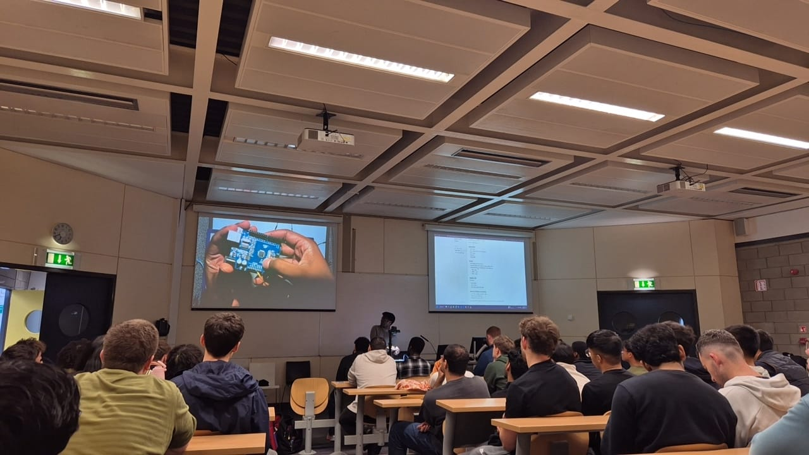

# Workshop 01 - RGB Controllers

Learn how microcontrollers work by building and programming an Arduino circuit. This workshop goes beyond blinking a single LED: participants create a pseudo-RGB light strip, use PWM to mix colours, and explore how multiple Arduinos can communicate to build longer chains of lights and effects.

This track is designed for beginners and works well as an opening hardware workshop at a hackathon or club event.

