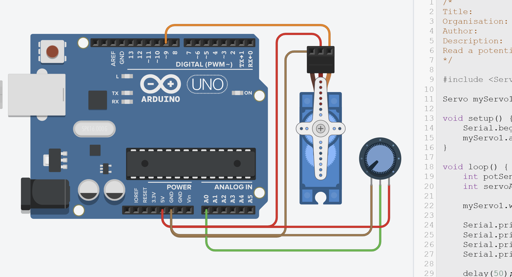

# Workshop 02 - Signals to Speed

Dive into motor controllers and electromechanical motion. This hands-on track is for anyone curious about how robots move, how PWM controls speed, or what makes a servo tick.

This lab will explore:
- How microcontrollers can **control DC motors, servos, and more**
- Using **PWM** to vary speed and direction
- Concepts like **torque, back-EMF, and H-bridges**
- How to **wire and safely power** your circuit, as well as **program** simple movements.

The workshop builds on basic Arduino skills, but beginners can follow the guided steps. By the end, participants will have built a working motor-control circuit and be ready to apply the same ideas in a larger project.

