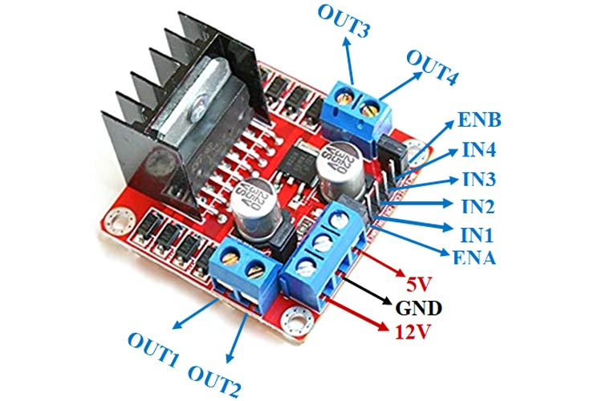
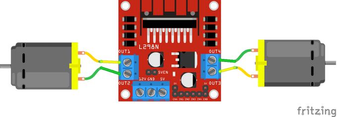
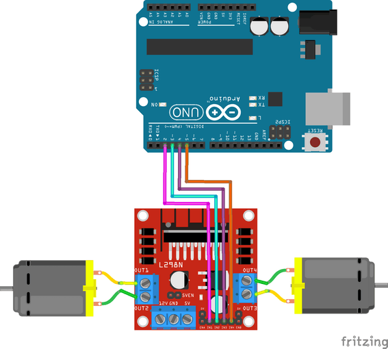

# Task 0: Assemble and wire the car

Start with the power and motor wiring. Leave the battery disconnected until
every connection has been checked.

## L298N connections

### 1. Identify the L298N pins

The exact silkscreen can vary between modules, so compare the labels printed on
your board with this pinout before connecting anything.

### 2. Connect both motors

Connect the left motor to OUT1 and OUT2. Connect the right motor to OUT3 and
OUT4.

The direction of each motor depends on which lead is connected to each output.
If forward and reverse are swapped, disconnect the battery and switch that
motor's two leads.

### 3. Connect the Arduino direction pins

Connect IN1 through IN4 to Arduino digital pins D2 through D5, then join the
Arduino GND and L298N GND.

{: .warning}
> **Do not blindly copy the 5V-to-5V wire shown in the diagram.** For this
> workshop, power the Arduino through USB and connect only the grounds together.
> Connecting the L298N 5V output to an Arduino that is already USB-powered can
> back-feed its power rail. Ask a facilitator before using the L298N's onboard
> 5V regulator.

### 4. Add speed control

Remove the ENA and ENB jumper caps, then connect ENA to Arduino D9 and ENB to
Arduino D10. These PWM pins let the sketch control each motor's speed.

| L298N pin | Connect to | Purpose |
|---|---|---|
| OUT1 / OUT2 | Left motor | Motor A terminals |
| OUT3 / OUT4 | Right motor | Motor B terminals |
| IN1 | Arduino D2 | Left direction input 1 |
| IN2 | Arduino D3 | Left direction input 2 |
| IN3 | Arduino D4 | Right direction input 1 |
| IN4 | Arduino D5 | Right direction input 2 |
| ENA | Arduino D9 | Left speed PWM |
| ENB | Arduino D10 | Right speed PWM |
| GND | Arduino GND and battery negative | Shared reference |
| +12V / VMOT | Battery positive | Motor supply (within module rating) |

Leave the ENA/ENB jumpers fitted only if you want full speed all the time. For
software speed control, remove those jumpers and use D9/D10 as shown above.

## Build the chassis

1. Mount the motors opposite each other so both wheels touch the floor.
2. Add the caster at the front or rear to keep the chassis balanced.
3. Secure the Arduino, driver, and battery so nothing can reach the wheels.
4. Spin each wheel by hand. They should turn freely without rubbing the frame.

## Checkpoint

Before moving on, verify that the battery is disconnected, the grounds are
connected, no motor wire is touching 5V, and the motor supply matches the motor
and driver ratings.
