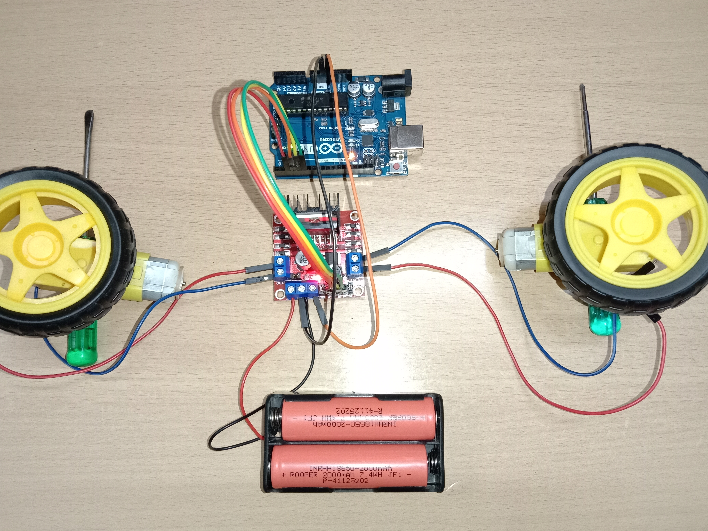

# Workshop 03 - Make an RC Car at Home!

Build a small two-wheel robot car using an Arduino Uno, an L298N dual H-bridge,
two DC motors, and a simple battery pack. You will learn how motor direction,
speed, and mechanical traction work together.

This workshop is an original Build Hub adaptation of the [Arduino Project Hub
L298N motor-driver project](https://projecthub.arduino.cc/lakshyajhalani56/l298n-motor-driver-arduino-motors-motor-driver-l298n-7e1b3b).
Use that page as an additional reference, not as a replacement for the safety
and wiring checks here.

## What you are building

## What you will learn

- Why an Arduino pin cannot power a motor directly
- How an L298N H-bridge reverses a motor
- How PWM changes motor speed
- How to share a safe ground between the controller and motor supply
- How to tune two motors so a car drives straight

## Parts

- Arduino Uno or compatible board
- L298N dual H-bridge motor-driver module
- Two small brushed DC gear motors and two wheels
- One free-rolling caster or skid
- Battery holder suitable for your motors
- Jumper wires and a small chassis (cardboard is fine)
- Screwdriver and tape, zip ties, or hot glue for mounting

## Safety first

Disconnect the battery while changing wires. Do not connect a motor directly to
an Arduino I/O pin. Check the motor voltage rating before choosing a battery,
avoid shorting the battery pack, and keep wheels off the table while testing.

## Workshop route

1. [Assemble and wire the car](Task0.md)
2. [Program forward, reverse, and speed control](Task1.md)

## Video walkthroughs

These external videos cover the same motor-driver concepts and are included as
optional visual companions:

<iframe width="560" height="315" src="https://www.youtube.com/embed/fqBLIrwq2YA" title="Using an L298N motor driver with Arduino and two DC motors" frameborder="0" allow="accelerometer; autoplay; clipboard-write; encrypted-media; gyroscope; picture-in-picture; web-share" allowfullscreen></iframe>

[Watch the L298N two-motor walkthrough on YouTube](https://youtu.be/fqBLIrwq2YA)

<iframe width="560" height="315" src="https://www.youtube.com/embed/xHbsWyoijb4" title="L298N motor driver with Arduino explained" frameborder="0" allow="accelerometer; autoplay; clipboard-write; encrypted-media; gyroscope; picture-in-picture; web-share" allowfullscreen></iframe>

[Watch the L298N wiring and code explanation on YouTube](https://youtu.be/xHbsWyoijb4)
