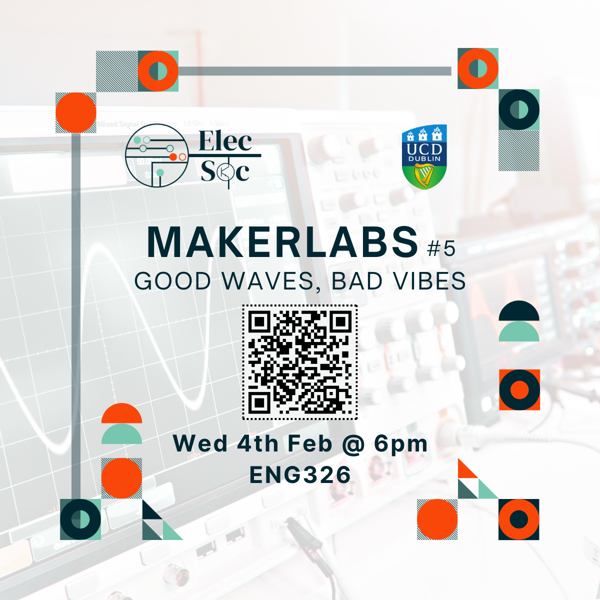

<iframe
  src="https://luma.com/embed/event/evt-13Iwr2bsepOVLGz/simple"
  width="600"
  height="800"
  frameborder="0"
  style="border: 1px solid #bfcbda88; border-radius: 4px;"
  allow="fullscreen; payment"
  aria-hidden="false"
  tabindex="0"
></iframe>

# MakerLab5 - Good Waves, Bad Vibes
Join [*Joe Biju*](https://www.linkedin.com/in/joebiju456/) for our first MakerLab of 2026 :O

​In this MakerLab, we’ll learn how engineers stop guessing and start seeing what’s really going on using an oscilloscope. You’ll go beyond “does it turn on?” and learn how to read waveforms, timing, noise, and phase - **the difference between good waves and bad vibes**.

​We’ll work through three hands-on stages:
- ​Spin: **Generate AC waveforms** by using signal generators and spinning a brushless motor and explore why three-phase power dominates the real world. 
-  Sync: **Capture and decode** a secret message (you may need to do clean up noise!). First team to suceed gets a prize.
-  Sound: Push oscilloscopes beyond engineering and create sick **oscilloscope music**! (watch the first minute of [this](https://youtu.be/4gibcRfp4zA) video)

​By the end of this lab, using an oscilloscope will be less of a mystery - and you can be a **saviour** for the class when everyone is lost :D

Come along for some fun, practical learning - no prior experience needed!

----

*(Note: You must be a member of ElecSoc to participate. If you are not already signed up, you can sign up on arrival. Card payment is accepted.)*

----
Sign up below on Luma as there are limited seats!

👉 [Luma Event Registration Link](https://luma.com/alcj2doc)

----
