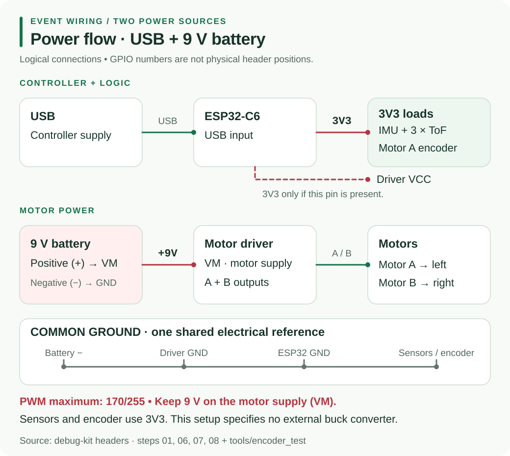

# H5 - 2S Battery to 5V Buck Converter

<div class="hardware-media-grid">
  <figure>
    
    <figcaption>Compact MP1584EN adjustable module</figcaption>
  </figure>
  <figure>
    
    <figcaption>Larger LM2596 adjustable module</figcaption>
  </figure>
</div>

A buck converter steps the **2S battery voltage** down to a regulated **5.0 V system rail**. A 2S Li-ion pack is about 7.4 V nominal and reaches 8.4 V when fully charged.



<p class="hardware-alert">⚠ A buck converter is not a charger or a battery-protection circuit. Use a protected 2S pack or suitable BMS, the correct 2S balance charger, a fuse and a main switch.</p>

## Connect it

| Buck terminal | Connection |
|---|---|
| `IN+` | protected battery `P+`, through the fuse and switch |
| `IN-` | protected battery `P-` |
| `OUT+` | 5 V system rail and the ESP32-C6 board's documented `5V` pin |
| `OUT-` | common `GND` for controller, sensors and motor driver |

The motor driver's `VM` supply should come from the planned motor power path, not through this clean 5 V logic rail. All circuits still need a common ground.

For the existing Micromouse guides, power the SEN0142 and GY-530 sensor boards from the ESP32-C6 `3V3` rail. Never apply 5 V to an ESP32-C6 GPIO.

## Set 5.0 V before connecting electronics

1. Disconnect the ESP32-C6, sensors and motor driver from the converter output.
2. Check the battery polarity, then power only the converter input.
3. Set a multimeter to DC volts and measure across `OUT+` and `OUT-`.
4. Turn the trim potentiometer slowly until the meter reads **5.00 V**. The direction and number of turns vary between modules.
5. Switch off, connect the intended load, then power on and measure the rail again.
6. Check that the voltage stays stable and the module, wires and connectors do not overheat.

{: .warning}
> Do not connect USB power and the external 5 V rail to the ESP32-C6 at the same time. Espressif lists USB, the 5V/GND headers and the 3V3/GND headers as mutually exclusive power options.

## Size the module for the real load

Add the controller's peak current, every sensor and a safety margin. The current printed in an IC datasheet is not a guarantee that a small low-cost module can deliver that current continuously without overheating.

```text
required 5 V current = controller peak + sensors + other logic + margin
```

Choose the MP1584EN for a compact build or the physically larger LM2596 module when easier terminals and adjustment matter. In either case, test the exact module under the robot's real load.

## First power-on check

- Battery input is the right polarity and below the module's rated maximum.
- Output is 5.00 V before the controller is attached.
- The 5 V and 3.3 V rails do not sag when Wi-Fi, sensors and motors operate.
- Motor noise does not reset the ESP32-C6 or corrupt sensor readings.
- The converter and wiring remain safely cool during a full-length run.

If the controller resets when motors start, measure both the 5 V rail and battery voltage during acceleration. Improve wiring, grounding, decoupling or the power architecture instead of raising the converter output above 5 V.

## Watch: adjust an LM2596 module

<div class="video-frame">
  <iframe src="https://www.youtube.com/embed/DOzRZb4fA4o" title="LM2596 buck converter tutorial: adjust the output voltage correctly" frameborder="0" allow="accelerometer; autoplay; clipboard-write; encrypted-media; gyroscope; picture-in-picture; web-share" referrerpolicy="strict-origin-when-cross-origin" allowfullscreen></iframe>
</div>

The video demonstrates the important method: measure the output while adjusting the trimmer, then verify it again under load. An MP1584EN module uses the same process, but its terminal positions and trim direction may differ.

## References

- [MPS MP1584 product page](https://www.monolithicpower.com/en/products/power-management/switching-converters-controllers/step-down-buck/converters/mp1584.html)
- [TI LM2596 product page and datasheet](https://www.ti.com/product/LM2596)
- [Espressif ESP32-C6-DevKitC-1 power-supply options](https://docs.espressif.com/projects/esp-dev-kits/en/latest/esp32c6/esp32-c6-devkitc-1/user_guide_v1.1.html#power-supply-options)
- [LM2596 adjustment video on YouTube](https://www.youtube.com/watch?v=DOzRZb4fA4o)
