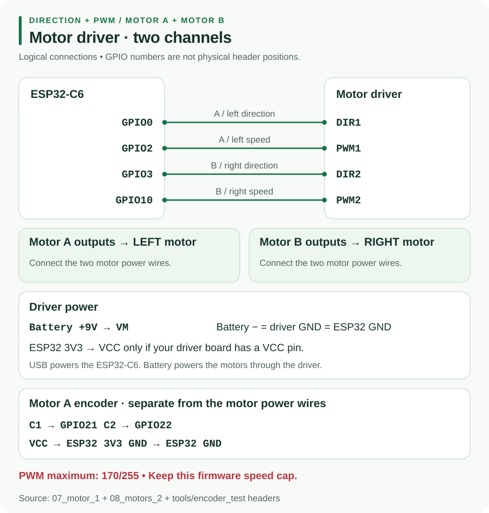

# H2 - DRI0044 Motor Driver and Encoder

The debug sketches use **one direction input and one PWM input per motor**. Motor A is left; Motor B is right. Follow these signal names and your board's printed labels.

## Exact wiring

Disconnect power before changing wires. Power the ESP32-C6 over USB and raise the wheels before connecting the motor battery.

| Driver connection | Connect to |
|---|---|
| DIR1 | ESP32 GPIO0 |
| PWM1 | ESP32 GPIO2 |
| DIR2 | ESP32 GPIO3 |
| PWM2 | ESP32 GPIO10, **not GPIO5** |
| VM | separate 9 V motor battery positive |
| GND | ESP32 GND **and** motor battery negative, all joined |
| VCC, only if present | ESP32 3V3 |
| STBY / EN / SLP, only if present | HIGH at 3V3, following the step 7 comments |
| Motor A outputs | left motor's two power wires (M1 / M2) |
| Motor B outputs | right motor's two power wires |

Encoder wires are separate from the motor power wires and are not needed for steps 7 and 8. Never connect the motor battery to controller, sensor or encoder power. See the [power guide](#/docs/Micromouse2026/Hardware/BuckConverter.md).

## PWM and Arduino setup

The motor sketches use 20 kHz, 8-bit PWM, capped at **170/255**. The comments describe this as about 6 V average from a **9 V battery** for the N20 motors. Steps 7 and 8 run at **140**; the encoder test runs at **85**. Do not raise `SPEED_MAX`. PWM still switches the battery voltage; it is not a regulated 6 V supply.

Use Arduino-ESP32 **3.0.0 or newer**, board **ESP32C6 Dev Module**. No additional motor library is needed. For optional Serial output, enable USB CDC On Boot and use 115200 baud.

## Test Motor A, then Motor B

Upload [07_motor_1](#/docs/Micromouse2026/Debug/07_motor_1.md) with Motor A, DIR1 and PWM1 connected. It starts automatically; keep the wheel raised.

| LED | Duration | Motor A / Serial result |
|---|---|---|
| Red at startup | 1.5 seconds, once | off; clear your hands |
| Green | 2 seconds | forward, `speed=+140` |
| Red | 1 second | stopped, `speed=+0` |
| Blue | 2 seconds | backward, `speed=-140` |
| Red | 1 second | stopped; repeat from green |

If green turns the wheel the wrong way, switch off power and swap that motor's two power wires.

Add Motor B and upload [08_motors_2](#/docs/Micromouse2026/Debug/08_motors_2.md), with both wheels in the air:

| LED | Action for 2 seconds | Left / right speed |
|---|---|---|
| Green | both forward | +140 / +140 |
| Blue | both backward | -140 / -140 |
| Yellow | spin left: left backward, right forward | -140 / +140 |
| Purple | spin right: left forward, right backward | +140 / -140 |

A red, one-second stop separates every action. If left and right are exchanged, power off and swap which motor connects to A and B. If only B fails, check DIR2 and PWM2.

## Motor A encoder

Keep step 7 wiring and add these connections for [encoder_test](#/docs/Micromouse2026/Debug/encoder_test.md):

| Encoder pin | ESP32-C6 |
|---|---|
| C1 | GPIO21 |
| C2 | GPIO22 |
| VCC | **3V3, never the motor battery** |
| GND | GND |

The motor starts automatically after its startup pause at PWM 85. Green means running, red means stopped. Serial prints `enc=...` and `ticks/s=...` once a second: counts increase and ticks/s is roughly steady while spinning. Example counts in the sketch are illustrative.

Send `s` to stop, `g` to go and `z` to zero. After stopping, the count settles and ticks/s reaches zero. Zero counts while spinning suggest missing encoder power or C1. Negative ticks/s means swap C1 and C2 with power off. Counts jumping while stopped suggest noise from motor wires.

## Troubleshooting tools

If the LED cycles but the motor stays still, check PWM and DIR jumpers, battery voltage at VM and the shared ground. Check VCC and enable wiring only if those pins exist.

[motor_sweep](#/docs/Micromouse2026/Debug/motor_sweep.md) shows blue for two seconds at startup, then ramps forward in green and backward in red up to PWM 170. Each direction takes about six seconds including a 1.5-second hold at maximum. There is no Serial output. Starting partway through the ramp means more duty was needed; humming without turning suggests battery sag or a jam; silence suggests no power reaching the motor.

**Unplug the motor from the driver before uploading or running [pin_test](#/docs/Micromouse2026/Debug/pin_test.md).** It sets PWM fully HIGH and could apply the full 9 V to the 6 V motor. It has no Serial output. Put a DC voltmeter's black probe on GND; after the two-second blue startup, each stage lasts two seconds:

| LED | GPIO0 | GPIO2 |
|---|---|---|
| Green | 3.3 V | 3.3 V |
| Yellow | 3.3 V | 0 V |
| Red | 0 V | 0 V |

Matching readings confirm the outputs switch; check the driver, its power and connecting wires next. A pin stuck low suggests a short or damaged pin. No blue startup suggests the new sketch did not upload.

See the [debug index](#/docs/Micromouse2026/Debug/index.md) for the complete sequence.
