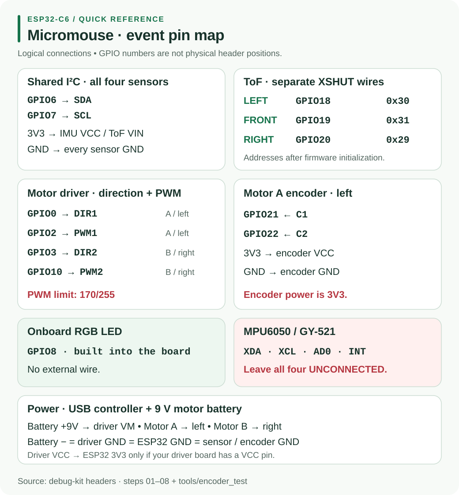

# H1 - ESP32-C6 Controller Guide

This wiring follows the top-of-file comments in `micromouse-debug-kit`. Numbers mean **GPIO numbers**, not positions along the board header.

## Exact pin map

| Connection | ESP32-C6 | Notes |
|---|---|---|
| IMU and all ToF SDA | GPIO6 | shared I2C data |
| IMU and all ToF SCL | GPIO7 | shared I2C clock |
| Left ToF XSHUT | GPIO18 | address `0x30` after initialization |
| Front ToF XSHUT | GPIO19 | address `0x31` after initialization |
| Right ToF XSHUT | GPIO20 | address `0x29` |
| Motor A / left DIR1 | GPIO0 | direction |
| Motor A / left PWM1 | GPIO2 | speed |
| Motor B / right DIR2 | GPIO3 | direction |
| Motor B / right PWM2 | GPIO10 | not GPIO5 |
| Motor A encoder C1 | GPIO21 | encoder test |
| Motor A encoder C2 | GPIO22 | encoder test |
| Onboard RGB LED | GPIO8 | already connected; do not reuse |

The kit does not assign a second motor encoder. Avoid adding wiring to GPIO4, GPIO5, GPIO8, GPIO9 and GPIO15: the kit identifies these as C6 strapping pins, with GPIO8 already used by the onboard LED.

## Power and sensor wiring

Power the controller from laptop USB. Connect a separate **9 V motor battery positive to driver VM**. Join battery negative, driver GND and ESP32 GND. Motor power goes through the driver.

Connect IMU VCC, ToF VIN and encoder VCC to ESP32 **3V3**, with their grounds connected to ESP32 GND. Never connect them to the motor battery. Connect driver VCC to 3V3 **only if present**; tie STBY / EN / SLP HIGH to 3V3 **only if the driver exposes such a pin**, as described in step 7.

For the MPU-6050 / GY-521, leave **XDA, XCL, AD0 and INT all unconnected**. Each ToF needs its own XSHUT wire. See the [power guide](#/docs/Micromouse2026/Hardware/BuckConverter.md).

## Arduino setup and first result

1. Install **esp32 by Espressif Systems, version 3.0.0 or newer** in Boards Manager. This is the Arduino-ESP32 board package version.
2. Select **ESP32C6 Dev Module**, the USB port, and **USB CDC On Boot: Enabled**.
3. Set Serial Monitor to **115200 baud**, **No Line Ending**.
4. Install **VL53L0X by Pololu** for ToF sketches only. `Adafruit_VL53L0X` does not match this code. The IMU needs no additional library.
5. Upload [01_led_red](#/docs/Micromouse2026/Debug/01_led_red.md) with only USB connected. Open Serial Monitor and press RESET.

Expected: solid red onboard LED, `STEP 1: LED should be RED`, then a new `alive` line every second.

## Bring up the robot in order

Follow the [debug index](#/docs/Micromouse2026/Debug/index.md), disconnecting power before changing wires.

| Sketch | Add or test | Expected result |
|---|---|---|
| [02_imu](#/docs/Micromouse2026/Debug/02_imu.md) | IMU alone | PASS; heading follows a turn |
| [03_tof_1](#/docs/Micromouse2026/Debug/03_tof_1.md) | left ToF | `1/1 sensors OK` |
| [04_tof_2](#/docs/Micromouse2026/Debug/04_tof_2.md) | front ToF | `2/2 sensors OK` |
| [05_tof_3](#/docs/Micromouse2026/Debug/05_tof_3.md) | right ToF | `3/3 sensors OK` |
| [06_tof_3_imu](#/docs/Micromouse2026/Debug/06_tof_3_imu.md) | combined sensors | all four devices PASS |
| [07_motor_1](#/docs/Micromouse2026/Debug/07_motor_1.md) | driver, battery, Motor A | forward, stop, reverse, stop |
| [08_motors_2](#/docs/Micromouse2026/Debug/08_motors_2.md) | Motor B | forward, backward, spin left, spin right |

Only connect the ToF sensors listed in the current step. An extra powered sensor with XSHUT unconnected starts at `0x29` and can disrupt the others. The IMU may stay connected during ToF steps.

Raise the wheels for motor tests. Steps 7 and 8 run at PWM **140**, capped at **170/255** with the 9 V battery. Do not raise the cap.

## Troubleshooting

| Symptom | Check or next test |
|---|---|
| No upload port | try a USB data cable and select Tools → Port; if needed hold BOOT, tap RESET, release BOOT and upload |
| Red LED but blank Serial | enable USB CDC On Boot, re-upload, use 115200 baud and press RESET with the monitor open |
| Old LED pattern | confirm the intended sketch uploaded successfully |
| Sensor missing | verify 3V3, GND, SDA6 and SCL7; run [i2c_scan](#/docs/Micromouse2026/Debug/i2c_scan.md) |
| Wrong distance column changes | restore left/front/right XSHUT to GPIO18/19/20 |
| Motor LED cycles but wheel stays still | check PWM, DIR, shared GND, battery on VM and any enable pin present |
| Need to verify GPIO0/GPIO2 | **unplug the motor first**, then run [pin_test](#/docs/Micromouse2026/Debug/pin_test.md) |
| Motor hums without moving | check battery sag or a jam; use [motor_sweep](#/docs/Micromouse2026/Debug/motor_sweep.md) |

If adding a device breaks a passing step, disconnect that addition and repeat the earlier test. Record the sketch name, startup output and actual wiring when asking for help.
