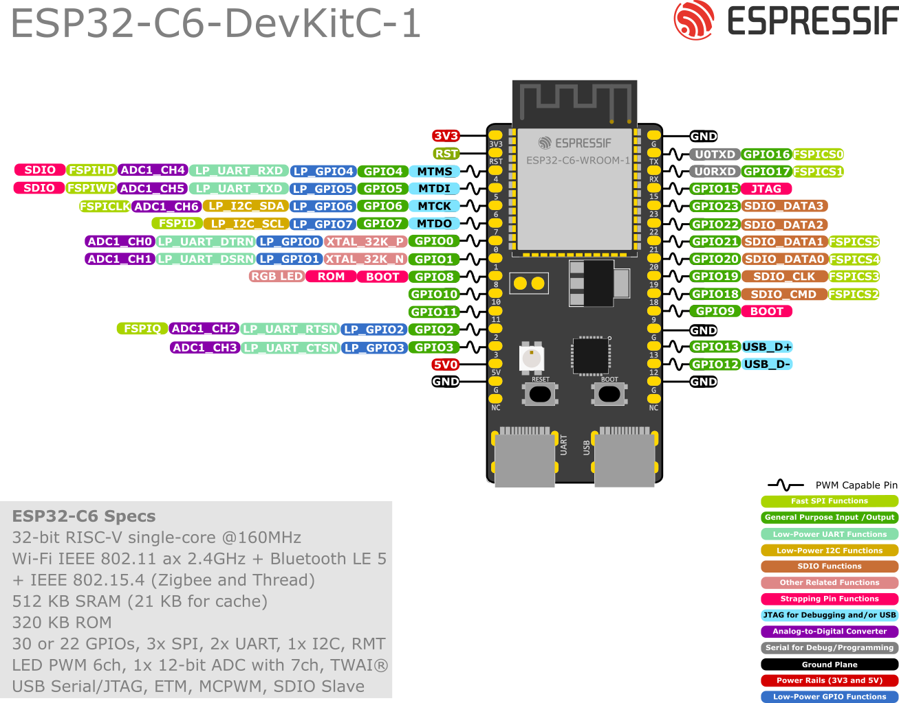

# H1 - ESP32-C6 Controller Guide

<figure class="esp32-pinout-hero">
  
</figure>

<p class="esp32-gpio-warning">⚠ GPIO matters: always check this ESP32-C6-DevKitC-1 pinout, your exact board revision and the team pin map before wiring hardware or assigning pins in code.</p>

The ESP32-C6 is the controller at the centre of your Micromouse. It reads sensors, measures wheel movement, generates motor-control signals and runs the navigation code.

This guide explains what each connection does, how to plan the wiring and how to bring the controller up safely. It does not give one universal pinout because ESP32-C6 development boards and custom carrier boards expose the chip differently.

By the end, you will be able to:

- identify the exact ESP32-C6 board in your kit;
- separate logic power from motor power;
- choose suitable interfaces for sensors, encoders and a motor driver;
- record a pin map that code and wiring can share; and
- test the controller one subsystem at a time.

## 1. Know what the ESP32-C6 provides

The ESP32-C6 combines a 32-bit RISC-V processor with 2.4 GHz Wi-Fi 6, Bluetooth Low Energy and IEEE 802.15.4 connectivity. For a Micromouse, the most useful features are the programmable GPIO pins and the built-in peripheral controllers.

| Interface | What it does | Typical Micromouse use |
|---|---|---|
| GPIO input | Reads a high or low voltage | encoder pulses, buttons, fault signals |
| GPIO output | Produces a high or low voltage | motor-driver direction, sensor shutdown |
| PWM | Produces a repeating pulse with adjustable duty cycle | motor speed control |
| ADC | Converts an analogue voltage into a number | battery or analogue sensor measurement |
| I2C | Communicates with several addressed devices over two signal wires | distance sensors, IMU or display |
| UART | Sends and receives serial data | logs, debugging or a serial peripheral |
| USB | Powers, flashes and debugs supported development boards | loading firmware and viewing logs |

Wireless features are useful for telemetry and setup, but your mouse should still be able to run its core control loop without a network connection.

## 2. Identify your exact board first

`ESP32-C6` names the chip family, not one single board layout. Before wiring anything, write down:

```text
Board or module name:
Board revision:
USB connector used:
Link to the board schematic or pinout:
Power input expected by this board:
```

For example, Espressif's ESP32-C6-DevKitC-1 exposes most available GPIO pins on two headers and includes both a USB-to-UART port and a native ESP32-C6 USB port. A smaller third-party board may use different labels, fewer pins or a different USB arrangement.

{: .warning}
> Never choose pins from an ESP32, ESP32-C3 or another ESP32-C6 board diagram just because the board looks similar. Match the exact printed board name and revision.

## 3. Protect the controller from electrical damage

### Use 3.3 V logic

The ESP32-C6 is a 3.3 V device. Treat its GPIO signals as **3.3 V only** and do not feed a 5 V signal into a GPIO. If a peripheral outputs 5 V logic, use a suitable level shifter or voltage divider after checking the signal type and speed.

### Do not power motors from a GPIO

A GPIO is a control signal, not a motor power source. Connect the controller to a motor driver, and let the motor driver switch the motor supply.

```text
Battery ───────────────> motor driver motor supply ──> left and right motors
   │
   └─> voltage regulator ──> ESP32-C6 board and logic supply

ESP32-C6 GPIO/PWM ─────> motor driver control inputs
ESP32-C6 GND ──────────> motor driver GND
```

The controller, sensors and motor driver need a shared ground reference unless the design deliberately uses electrical isolation.

### Avoid competing power sources

On the official ESP32-C6-DevKitC-1, USB, the 5 V header and the 3V3 header are documented as mutually exclusive power options. Do not connect several power sources at the same time unless the exact board schematic explicitly supports it.

{: .warning}
> Remove motor power before changing wires. A loose jumper can momentarily connect battery voltage to a GPIO and permanently damage the controller.

## 4. Match each device to an interface

### Motor driver

Most dual motor drivers need two kinds of signal:

- **direction inputs** select forward, reverse, brake or coast;
- **PWM inputs** control average motor power and therefore speed.

The ESP32-C6 LEDC peripheral can generate PWM signals. In code, set the PWM frequency, resolution and duty cycle, then attach each channel to the chosen output GPIO.

Do not connect a motor directly to the ESP32-C6. Check that the driver's logic-input thresholds accept 3.3 V signals and that its motor voltage and current ratings suit the motors.

### Wheel encoders

Digital encoders normally connect to GPIO inputs. If an encoder output is open-collector or open-drain, it also needs a pull-up resistor to the correct logic voltage.

Use interrupt-capable or pulse-counting logic when pulse timing matters. Keep encoder wires away from motor leads where possible, because motor noise can create false counts.

### I2C distance sensors

I2C normally uses:

- **SDA** — serial data;
- **SCL** — serial clock; and
- **GND** — the common voltage reference.

SDA and SCL are shared by every device on the bus and require pull-up resistors. Many sensor breakout boards already include them, so inspect the board before adding more.

Devices on one I2C bus must have different addresses. If several identical sensors power up with the same address, use their **XSHUT** or enable pins to start them one at a time and assign new addresses in software.

### Analogue signals

Use an ADC-capable pin only for voltages inside the permitted input range. A battery voltage normally needs a resistor divider before it reaches the ADC.

ADC readings vary between chips and can contain noise. Average repeated readings and use the ESP-IDF calibration support when the actual voltage matters.

## 5. Reserve special pins deliberately

Some pins affect boot mode, USB or debugging. On the official ESP32-C6-DevKitC-1:

- GPIO4, GPIO5, GPIO8, GPIO9 and GPIO15 are strapping pins;
- GPIO12 and GPIO13 are also used for native USB D- and D+; and
- GPIO16 and GPIO17 are labelled for the UART connection.

This does not mean those pins can never be used. It means an attached circuit must not force the wrong level during reset or interfere with the feature you still need.

{: .warning}
> The list above is a board-planning example for ESP32-C6-DevKitC-1. Verify the schematic and pin table for the exact board in your kit before copying it.

## 6. Create one shared pin map

Choose pins only after listing every required signal. Keep the result beside the firmware so the physical mouse and the code use the same names.

| Function | Board pin | Direction | Interface | Voltage | Notes |
|---|---|---|---|---|---|
| Left motor PWM | TBC | output | PWM | 3.3 V logic | motor driver input |
| Left motor direction | TBC | output | GPIO | 3.3 V logic | motor driver input |
| Right motor PWM | TBC | output | PWM | 3.3 V logic | motor driver input |
| Right motor direction | TBC | output | GPIO | 3.3 V logic | motor driver input |
| Left encoder | TBC | input | GPIO/pulse counter | check device | check pull-up |
| Right encoder | TBC | input | GPIO/pulse counter | check device | check pull-up |
| Sensor SDA | TBC | bidirectional | I2C | 3.3 V | shared bus |
| Sensor SCL | TBC | output/open-drain | I2C | 3.3 V | shared bus |
| Sensor XSHUT pins | TBC | output | GPIO | check device | one per identical sensor |
| Battery monitor | TBC | input | ADC | divided to safe level | optional |

Before approving the map, check:

- [ ] every signal has exactly one intended purpose;
- [ ] no required flash, USB or debug signal has been accidentally reused;
- [ ] strapping pins will have safe levels during reset;
- [ ] analogue inputs use ADC-capable pins;
- [ ] all logic voltages are compatible;
- [ ] the number of PWM, encoder and XSHUT signals is sufficient; and
- [ ] the same names appear in the schematic, wiring table and firmware.

## 7. Bring up the board in a safe order

Do not assemble the entire mouse and then switch it on for the first time. Add one subsystem at a time.

### Step 1 - Inspect without power

- Confirm board orientation and connector polarity.
- Check for solder bridges and loose strands of wire.
- Use continuity mode to look for a short between power and ground.
- Disconnect the motors from the driver outputs.

### Step 2 - Power and flash the controller

Power the board from its documented USB port. Load a minimal program and confirm that serial output works.

```cpp
void setup() {
  Serial.begin(115200);
  delay(1000);
  Serial.println("ESP32-C6 controller online");
}

void loop() {
  Serial.println(millis());
  delay(1000);
}
```

If upload fails, confirm the selected ESP32-C6 board and port. On boards without automatic download control, hold **Boot**, press and release **Reset**, then release **Boot** to enter download mode.

### Step 3 - Test one output

Connect one known-safe output such as an LED or one unpowered motor-driver logic input. Confirm the measured pin changes as expected before adding the rest.

Use named constants rather than unexplained pin numbers:

```cpp
constexpr int LEFT_MOTOR_DIRECTION_PIN = PIN_FROM_YOUR_APPROVED_MAP;

void setup() {
  pinMode(LEFT_MOTOR_DIRECTION_PIN, OUTPUT);
  digitalWrite(LEFT_MOTOR_DIRECTION_PIN, LOW);
}
```

Replace the placeholder only after completing the pin map. Do not copy a random pin number from this page.

### Step 4 - Test the sensor bus

Connect one I2C sensor first. Confirm that its address appears, then test a real reading. Add identical sensors one at a time and verify the XSHUT/address sequence.

### Step 5 - Test the motor driver at low power

- Lift the wheels off the table.
- Start with a low PWM duty cycle.
- Test one motor and one direction at a time.
- Stop immediately if the controller resets, a component heats rapidly or the supply current is unexpected.

### Step 6 - Integrate the control loop

Only combine sensors, encoders and motors after each subsystem passes its own test. Record a Git checkpoint after every known-good stage.

## 8. Diagnose common faults

| Symptom | Likely checks |
|---|---|
| Board does not power | cable, connector, regulator output, short between power and ground |
| Firmware will not upload | correct board/port, data-capable USB cable, Boot/Reset sequence, USB pins not reused |
| Board resets when motors start | battery sag, regulator capacity, grounding, motor noise, missing decoupling |
| Motor does not move | driver enable, standby pin, PWM, direction truth table, motor supply |
| Encoder count jumps | pull-up, grounding, motor-noise routing, input filtering |
| I2C device is missing | SDA/SCL swapped, missing pull-ups, wrong voltage, address collision, XSHUT state |
| ADC value is unstable | source impedance, wiring noise, averaging, calibration, input voltage range |

Debug from measurements, not guesses. A useful report contains:

```text
Exact board and revision:
Power voltage measured at the board:
Connected devices and their voltages:
Pin map:
Expected behaviour:
Observed behaviour:
Serial output:
What changed since the last working test:
```

That information also gives a teammate or AI agent enough context to help without inventing a pinout.

## 9. Final pre-power checklist

- [ ] Exact board model and schematic confirmed.
- [ ] Battery polarity checked.
- [ ] ESP32-C6 GPIO signals stay within 3.3 V logic limits.
- [ ] Motors connect through a correctly rated motor driver.
- [ ] Controller and driver share ground.
- [ ] No conflicting power sources are connected.
- [ ] Strapping, USB and debug pins were reviewed.
- [ ] I2C pull-ups and duplicate addresses were checked.
- [ ] Wheels are raised for the first motor test.
- [ ] A current-limited supply or another safe first-power method is used where available.

## Official references

- [ESP32-C6 Series datasheet](https://documentation.espressif.com/esp32-c6_datasheet_en.html)
- [ESP32-C6-DevKitC-1 user guide](https://docs.espressif.com/projects/esp-dev-kits/en/latest/esp32c6/esp32-c6-devkitc-1/user_guide.html)
- [ESP32-C6 GPIO guide](https://docs.espressif.com/projects/esp-idf/en/stable/esp32c6/api-reference/peripherals/gpio.html)
- [ESP32-C6 LEDC/PWM guide](https://docs.espressif.com/projects/esp-idf/en/stable/esp32c6/api-reference/peripherals/ledc.html)
- [ESP32-C6 ADC calibration guide](https://docs.espressif.com/projects/esp-idf/en/stable/esp32c6/api-reference/peripherals/adc/adc_calibration.html)
- [ESP32-C6 I2C guide](https://docs.espressif.com/projects/esp-idf/en/stable/esp32c6/api-reference/peripherals/i2c.html)

## Key takeaway

The ESP32-C6 should coordinate the mouse, not supply its motors. Start with the exact board schematic, build one shared pin map and prove power, flashing, sensors and motor control separately before combining them.
