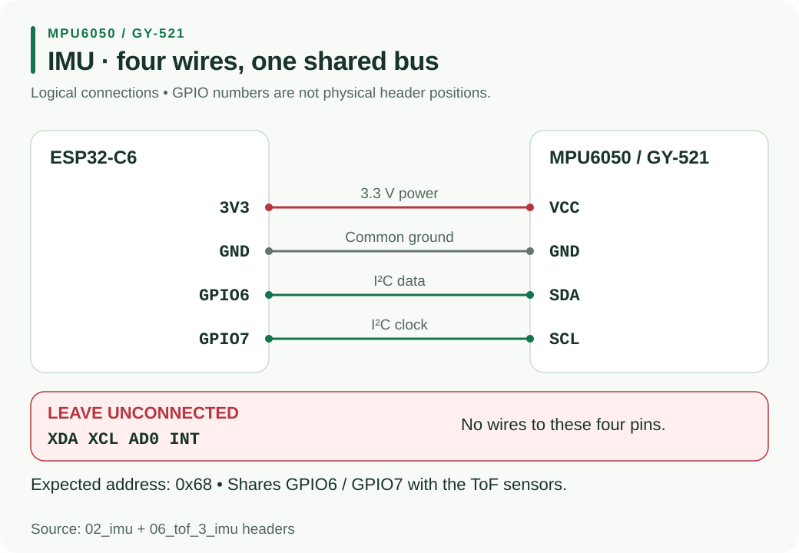

# H3 - MPU-6050 / GY-521 IMU

The debug kit tests an **MPU-6050 / GY-521** with four wires. Follow the supplied sketch’s wiring and check heading as you rotate the board.



## Exact wiring

For [02_imu](#/docs/Micromouse2026/Debug/02_imu.md), start with the IMU alone on the I2C pins and power the controller over USB.

| MPU-6050 / GY-521 pin | ESP32-C6 connection |
|---|---|
| VCC | 3V3 |
| GND | GND |
| SDA | GPIO6 |
| SCL | GPIO7 |
| XDA | leave unconnected |
| XCL | leave unconnected |
| AD0 | leave unconnected |
| INT | leave unconnected |

Use SDA/SCL, not XDA/XCL. Leave **all four unused pins unconnected**. The intended address is `0x68`.

## Run the isolated test

Use Arduino-ESP32 **3.0.0 or newer**, board **ESP32C6 Dev Module**, **USB CDC On Boot: Enabled**, and Serial Monitor at **115200 baud**. **No additional IMU library is needed**; the sketch uses `Wire` directly.

Upload [02_imu](#/docs/Micromouse2026/Debug/02_imu.md), open Serial Monitor and press RESET. Keep the board still for the first second during calibration. Typical startup:

```text
STEP 2: IMU test
idle SDA=1 SCL=1 (both should be 1)
Scan SDA=GPIO6 SCL=GPIO7: 0x68
PASS: MPU at 0x68, chip ID 0x68 (genuine)
Calibrating - keep STILL...
```

When still, `gyroZ` should be near zero. A quarter turn changes heading by about +90 degrees one way and -90 the other. When stopped, gyroZ returns near zero while heading remains near the angle reached. A slow creep while still is normal: heading is a relative turn estimate.

## Troubleshooting

| Output or symptom | Action |
|---|---|
| `chip ID 0x70 (clone - fine)` | accepted by the sketch; continue the movement test |
| `SDA and SCL are SWAPPED` | power down and restore SDA → GPIO6, SCL → GPIO7 |
| MPU at `0x69` because AD0 is HIGH | disconnect AD0 |
| `idle SDA=0 SCL=0` | check missing power, loose wires, shorts to GND and pull-ups |
| `FAIL: no MPU found either way round.` | check VCC → 3V3, GND, SDA/SCL rather than XDA/XCL, and INT unconnected |
| Heading changes rapidly while still | reset and keep the board still during calibration |
| Blank Serial | enable USB CDC On Boot, re-upload, select 115200 baud and press RESET |

The isolated sketch can find swapped SDA/SCL or address `0x69` and report what to fix. Correct the wiring before combining sensors. [i2c_scan](#/docs/Micromouse2026/Debug/i2c_scan.md) should show `0x68` for the normally wired IMU.

## Combined sensors

The IMU shares 3V3, GND, SDA6 and SCL7 with the ToF boards; XDA, XCL, AD0 and INT stay unconnected. [06_tof_3_imu](#/docs/Micromouse2026/Debug/06_tof_3_imu.md) should report left `0x30`, front `0x31`, right `0x29` and IMU `0x68` all PASS. Keep the robot still for initial calibration.

The combined output includes L/F/R distances, heading and gyroZ. Wave a hand before each sensor and rotate the robot. This step needs **VL53L0X by Pololu** for ToF only; no IMU library. If a device passed alone and now fails, disconnect the last addition and repeat the earlier test.

## Visualizer

Follow [imu_visualizer](#/docs/Micromouse2026/Debug/imu_visualizer.md) with the same wiring:

1. Upload `imu_visualizer/imu_visualizer.ino` with USB CDC enabled.
2. Close Arduino Serial Monitor so the browser can use the USB port.
3. Open `imu_visualizer/index.html` in Chrome or Edge.
4. Click **Connect board** and select the ESP32 COM port.
5. Keep the board still for one second, then rotate and tilt it.

The sketch sends 25 `IMU,` records per second: heading, turn rate, pitch and roll. Lines beginning with `#` are status messages. The page can send `z` to zero heading or `c` to recalibrate; remain still during recalibration. If connection fails, check that Serial Monitor has released the port.

Return to the [debug index](#/docs/Micromouse2026/Debug/index.md).
