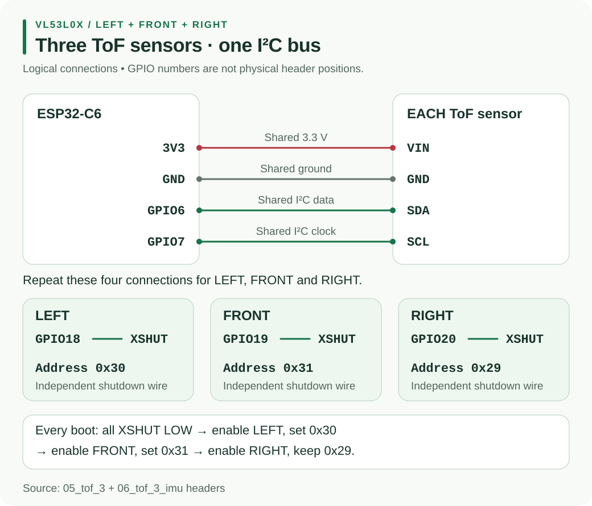

# H4 - 3x VL53L0X Distance Sensors

Use three VL53L0X Time-of-Flight sensors to measure the **left wall, front wall and right wall**. They share one I2C bus.

<div class="hardware-media-grid">
  <figure>
    
    <figcaption>Six-pin GY-530 VL53L0X board</figcaption>
  </figure>
  <figure>
    
    <figcaption>Left, front and right sensor wiring</figcaption>
  </figure>
</div>

<p class="hardware-alert">⚠ All VL53L0X sensors start at the same I2C address. Connect every XSHUT pin to a different ESP32-C6 GPIO and assign new addresses at every boot, or the three boards will conflict.</p>

## Wire the three sensors

| GY-530 pin | ESP32-C6 connection |
|---|---|
| `VIN` | `3V3` shared by all three boards |
| `GND` | common `GND` |
| `SDA` | one chosen I2C SDA GPIO, shared |
| `SCL` | one chosen I2C SCL GPIO, shared |
| left `XSHUT` | one dedicated output GPIO |
| front `XSHUT` | a second dedicated output GPIO |
| right `XSHUT` | a third dedicated output GPIO |
| `GPIO1` | leave unconnected for the first test |

Choose the actual SDA, SCL and three XSHUT GPIO numbers from the team's approved [ESP32-C6 pin map](#/docs/Micromouse2026/Hardware/ESP32C6.md).

Before soldering, check that your GY-530 boards expose `XSHUT`. Some boards sold under similar names only bring out four pins and are not suitable for this wiring plan without modification.

## Assign addresses at boot

The normal 7-bit address is `0x29`. The new addresses are temporary and disappear after reset or power-off.

```text
1. XSHUT left, front, right = LOW
2. Enable left  -> initialise at 0x29 -> change to 0x30
3. Enable front -> initialise at 0x29 -> change to 0x31
4. Enable right -> initialise at 0x29 -> change to 0x32
5. Confirm the I2C scan shows 0x30, 0x31 and 0x32
```

Keep the direction and address mapping in one place in the firmware:

```text
LEFT  = 0x30
FRONT = 0x31
RIGHT = 0x32
```

## Test it before mounting

1. Test one board first and confirm it reports distance in millimetres.
2. Add the other boards and check the three addresses after every restart.
3. Point each sensor at the same flat wall and compare the readings.
4. Mount them so the robot body, wheels and loose wires do not enter the sensors' view.
5. Read sensors in a fixed order and reject timeout or out-of-range values.

{: .warning}
> Do not assume the advertised 2 m maximum is the useful maze range. Dark, angled or very close surfaces can change the reading, so test with the real maze walls and record a safe control range.

## Watch: using multiple VL53L0X sensors

<div class="video-frame">
  <iframe src="https://www.youtube.com/embed/0glBk917HPg" title="Using two or more VL53L0X Time-of-Flight sensors" frameborder="0" allow="accelerometer; autoplay; clipboard-write; encrypted-media; gyroscope; picture-in-picture; web-share" referrerpolicy="strict-origin-when-cross-origin" allowfullscreen></iframe>
</div>

The video uses an Arduino, but the important hardware method is the same: shared I2C lines, separate XSHUT lines and one new address per sensor. Use your ESP32-C6 pin map rather than copying its Arduino GPIO numbers.

## References

- [ST VL53L0X product page](https://www.st.com/en/imaging-and-photonics-solutions/vl53l0x.html)
- [ST VL53L0X datasheet](https://www.st.com/resource/en/datasheet/vl53l0x.pdf)
- [ST AN4846: Using multiple VL53L0X in a single design](https://www.st.com/resource/en/application_note/dm00280486-using-multiple-vl53l0x-in-a-single-design-stmicroelectronics.pdf)
- [Pololu VL53L0X Arduino library](https://github.com/pololu/vl53l0x-arduino)
