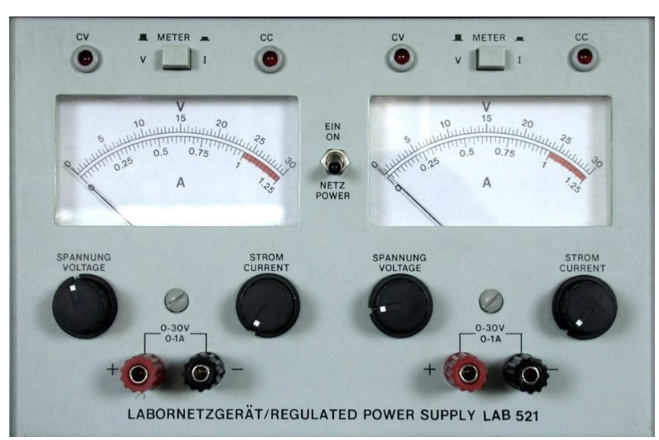

# Bench Power Supply

A bench power supply provides controlled electrical power while you build and test a circuit. Unlike a battery or fixed USB supply, it lets you set the output voltage and limit the maximum current.

Current limiting is one of its most useful features: a sensible limit can reduce the damage caused by a wiring mistake.

*Figure: Dual-output analogue bench supply used in UCD electronics laboratories. Image retained from **EEEN20020** teaching material.*

{: .warning-title}
> Use low voltage only
>
> This guide is for supervised, low-voltage Hack Club circuits. Do not connect a bench supply to mains wiring, unknown equipment, batteries being charged, or another power source unless the circuit and procedure have been specifically approved.
>
> Switch the output off before changing connections. Stop immediately if anything becomes hot, smells unusual, makes noise, or draws more current than expected.

## Watch: using a bench supply

This short SparkFun introduction shows voltage setting and current limiting on a typical bench supply. The controls look similar across brands, even if the layout on our lab units differs.

[How to Use a Power Supply (SparkFun)](https://youtu.be/uraPWaeAgYA)

<iframe width="560" height="315" src="https://www.youtube.com/embed/uraPWaeAgYA" title="YouTube video player" frameborder="0" allow="accelerometer; autoplay; clipboard-write; encrypted-media; gyroscope; picture-in-picture; web-share" referrerpolicy="strict-origin-when-cross-origin" allowfullscreen></iframe>

## Controls and connections

| Control | Purpose |
| --- | --- |
| Voltage setting | Sets the target potential difference between the output terminals |
| Current limit | Sets the maximum current the supply should deliver |
| Output control | Enables or disables power at the terminals |
| Voltage/current display | Shows the measured output voltage or current |
| Red terminal | Positive output for the usual positive-supply connection |
| Black terminal | Negative or return output for the usual positive-supply connection |

Some supplies contain two or more independent channels. Do not assume their negative terminals are internally connected; check the equipment documentation or ask a supervisor.

The unit pictured above contains two similar outputs. On that specific **EEEN20020** laboratory supply, each side has voltage and current controls, red and black 4 mm terminals, and an analogue meter that can display voltage or current. Its front panel marks each output as `0–30 V` and `0–1 A`. Those limits do not apply to every bench supply.

## Constant-voltage and constant-current operation

A bench supply normally operates in one of two modes:

- **Constant voltage (CV):** the supply maintains the selected voltage while the circuit draws less than the current limit.
- **Constant current (CC):** the circuit attempts to draw more than the limit, so the supply reduces its output voltage to hold the current near the selected limit.

Entering current-limit mode is not automatically a fault, but it often indicates a short circuit, reversed component, incorrect value, or limit set too low.

{: .note}
> The current control does not force that amount of current through the circuit. The circuit draws current according to its resistance and behaviour; the control sets an upper limit.

## Safe setup procedure

1. **Turn the output off.**
2. Check the circuit against its schematic and confirm component polarities.
3. Determine the required voltage and a sensible initial current limit.
4. With the circuit disconnected, set the required voltage.
5. Set the current limit using the equipment's approved procedure.
6. Connect positive to the circuit's supply input and negative to its return or ground.
7. Check that no loose wires can touch adjacent terminals.
8. Enable the output while watching the voltage and current readings.
9. If the readings are unexpected, disable the output before investigating.

## Choosing an initial current limit

Estimate the circuit's expected current from component datasheets, calculations, or a known-good design. Set the limit high enough for normal operation but low enough to provide useful protection.

For example, if a small circuit is expected to draw about `60 mA`, beginning near `100 mA` may be more useful than immediately allowing the supply's full current. The correct value depends on the circuit.

{: .think-title}
> Before enabling the output, be able to answer:
>
> **What current do I expect, and what will I do if the display is much higher or lower?**

## Reading the display

The voltage display is connected across the output. The current display reports current flowing from the supply into the circuit.

Analogue meters, like the one shown above, may have multiple scales. Check the meter switch and read the scale matching the selected function and range. Use a suitable multimeter when greater precision is required.

## Common problems

### The voltage falls when the circuit is connected

The supply may be in constant-current mode. Disable the output and check for shorts, reversed parts, incorrect wiring, or an unrealistically low current limit.

### The current reads zero

The output may be disabled, the circuit may be open, a wire may be in the wrong socket, or the circuit may not share the intended return path.

### The current immediately reaches the limit

Disable the output. Check continuity between the supply rails before trying again. Do not simply increase the limit until the circuit appears to work.

### The circuit works from USB but not from the supply

Confirm the voltage, polarity, current limit, and common ground. Some boards also require a power-selection jumper or a particular input connector.

## Shutdown

1. Disable the output.
2. Confirm the circuit is no longer powered.
3. Disconnect the leads from the circuit.
4. Return the controls and leads according to the lab procedure.
5. Report damaged insulation, loose terminals, unstable readings, or overheating.
