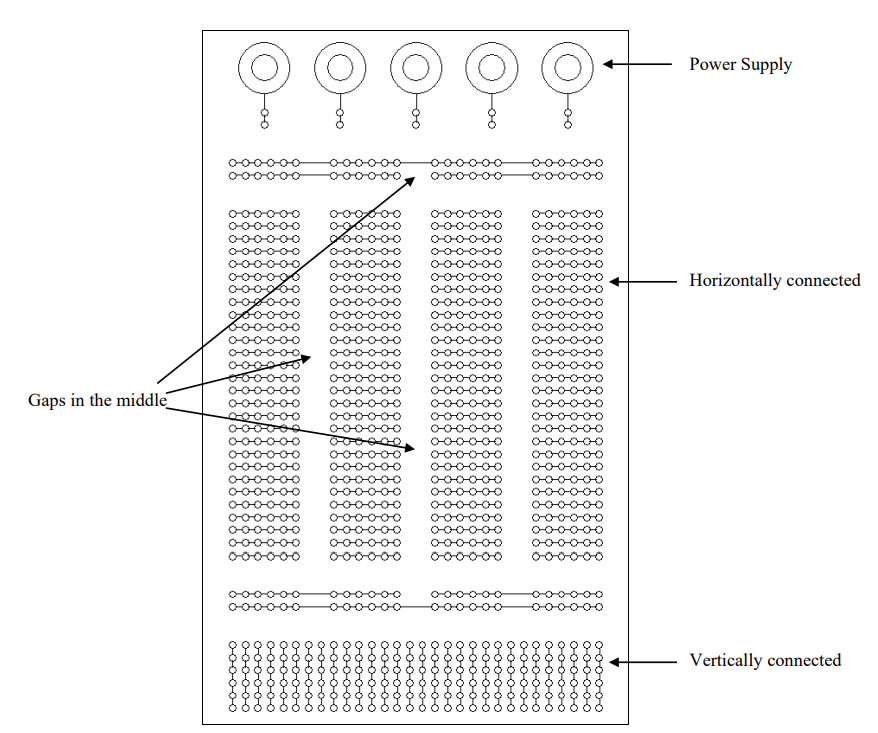
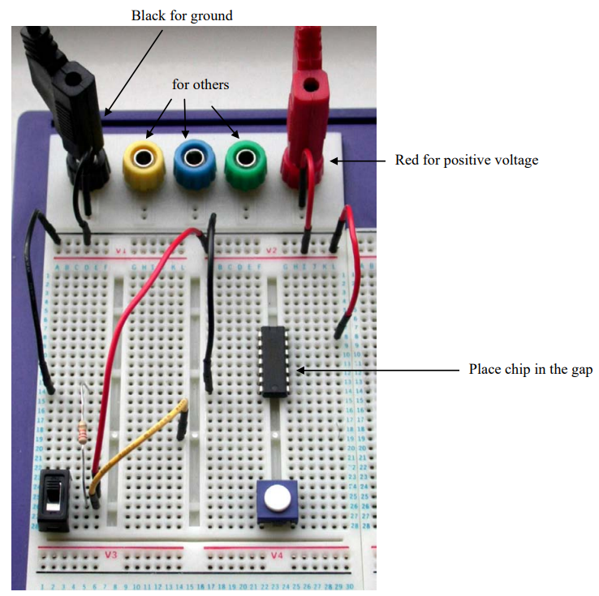

# Breadboards

A solderless breadboard lets you build and change low-voltage circuits without making permanent solder joints. Holes on the surface contain spring contacts that electrically join particular groups of holes underneath.

The pattern is not identical on every breadboard. Before building, inspect the markings or use continuity mode to confirm which holes are connected.

{: .warning-title}
> Breadboards are for suitable low-energy circuits
>
> Disconnect power before adding, removing, or moving components. Do not use a breadboard for mains voltage, high current, damaged components, or connections that can become dangerously hot.

## How the holes are connected

The main terminal area is divided into groups of connected holes. The centre gap separates the groups on its two sides and provides space for dual-inline integrated circuits.

Long rows near the edge are often used as **power rails**. These may be split partway along the board, so a rail that looks continuous may not be electrically continuous.



*Figure: Internal connections of the laboratory breadboard. Diagram retained from **EEEN20020** teaching material.*

The particular laboratory board shown above connects most terminal groups in sets of six. Many common breadboards use groups of five, so always check the board in front of you.

## Placing components

Every component must be connected between the intended electrical nodes.

For a resistor:

1. Bend the leads gently without stressing the component body.
2. Insert each lead into a different connected group.
3. Confirm that both leads are fully inserted.

If both resistor leads are placed in the same connected group, the breadboard shorts across the resistor and it has no useful effect in the circuit.

## Placing ICs, op-amps, and microcontrollers

Many integrated circuits use a **dual-inline package (DIP)** with two parallel rows of pins. Common examples include:

- DIP-packaged op-amps
- Logic-gate and timer ICs
- Motor-driver ICs
- DIP microcontrollers such as some ATmega chips

Place a DIP IC so it **straddles the centre gap**:

```text
connected group        centre gap        connected group
o o o o [ IC pins ]  |           |  [ IC pins ] o o o o
```

The pins on one side should enter terminal groups on one side of the gap, while the pins on the other side enter separate groups on the opposite side. Each pin then has its own row where jumper wires and components can be connected.

{: .warning-title}
> Do not place both rows on the same side
>
> If a DIP IC is placed entirely on one side of the centre gap, opposing pins may be connected together by the breadboard's internal contacts. This can prevent the circuit from working and may damage the IC when power is applied.

Before inserting an IC:

1. Disconnect power.
2. Find the pin-1 marker, usually a notch, dot, or bevel on the package.
3. Match its orientation to the schematic or wiring diagram.
4. Straighten the pin rows gently if needed.
5. Align both rows with the holes on opposite sides of the centre gap.
6. Press down evenly without bending the pins.
7. Check that every pin entered a hole and none folded underneath the package.

### Op-amps and other IC chips

Do not assume similarly shaped ICs have the same pinout. Two eight-pin chips can have completely different power, input, and output pins.

Always find the exact part number and check its pinout. Connect the power pins first, add any required decoupling capacitor close to the IC, and then connect signals.

{: .tip}
> Keep every IC facing the same direction where practical. A consistent notch orientation makes pin numbers easier to follow and reduces wiring mistakes.

### Microcontroller boards

Some small development boards, such as many Arduino Nano-style boards, are designed to straddle the centre gap in the same way as a wide DIP package. This leaves an accessible terminal group beside each header pin.

Larger boards such as an Arduino Uno do **not** plug into the breadboard. Connect them using jumper wires from their headers to the required breadboard rows.

Not every development board has the same width or pin arrangement. Before pressing one into place:

- Confirm that its two header rows fit on opposite sides of the gap.
- Check that accessible holes remain beside both rows.
- Verify the board's power pins and operating voltage.
- Make sure USB sockets and components are not forced against the breadboard.
- Disconnect USB and external power while changing the wiring.



*Figure: The IC is positioned across the centre gap so its opposing pins remain electrically separate. Image retained from **EEEN20050** teaching material.*

{: .tip}
> Build in small sections. After completing each section, compare it with the schematic and test for accidental shorts before adding more components.

## Using the power rails

A useful convention is:

- Red rail: positive supply
- Blue or black rail: ground or return

Colour is only a convention; it does not create polarity. Trace the wire back to the supply before assuming what a rail carries.

To use the rails safely:

1. Leave the power supply output off.
2. Connect supply positive to the chosen positive rail.
3. Connect supply return to the chosen ground rail.
4. Use continuity mode to check split rails.
5. Add jumper wires across any intended split.
6. Check for low resistance between positive and ground before applying power.

## From schematic to breadboard

A schematic shows **electrical connections**, not physical placement. Two points joined by an uninterrupted schematic line must share an electrical node on the breadboard.

A reliable approach is:

1. Identify the positive supply and ground nodes.
2. Place the main component or integrated circuit.
3. Build one functional block at a time.
4. Use short, colour-coded jumper wires where practical.
5. Check each connection against the schematic.
6. Mark completed connections on a printed or digital copy.

{: .think-title}
> Do not ask only “does my breadboard look like the picture?”
>
> Ask **“does every component connect to the same electrical nodes as the schematic?”**

## Good breadboarding habits

- Keep component leads short, but do not allow bare leads to touch.
- Use red for positive power and black or blue for ground where possible.
- Route signal wires consistently.
- Keep analogue or high-frequency signal paths short.
- Do not force oversized leads into the contacts.
- Avoid changing the circuit while powered.
- Photograph a working circuit before dismantling it.
- Label external wires and connectors.

## Common problems

### A component appears to do nothing

Check whether its leads are accidentally in the same connected group, whether the centre gap has been misunderstood, and whether the component is inserted fully.

### One side of the board has no power

The power rail may be split. Test continuity along the rail and bridge the split if the circuit requires it.

### The circuit works when a wire is pressed

The wire may be damaged, too small, loose, or inserted into a worn contact. Replace it and move to a reliable contact.

### The circuit behaves unpredictably

Look for floating inputs, long signal wires, poor grounding, loose connections, reversed polarized components, or supply noise.

### The supply enters current limit

Disable power immediately. Check for a direct connection between the positive and ground rails, misplaced component leads, reversed power wiring, or rails bridged unintentionally.

## Checking a breadboard with a multimeter

With all power disconnected:

1. Select continuity mode.
2. Test two holes believed to share a node.
3. Test across the centre gap; these points should normally be separate.
4. Test along each power rail to find splits.
5. Test between positive and ground for an accidental short.

## Module sources retained on this page

- The connectivity diagram and its description were adapted from **EEEN20020** laboratory teaching material.
- The populated breadboard image and placement guidance were adapted from **EEEN20050** teaching material.
- [Download the EEEN20050 breadboard handout (PDF)](../../assets/pdfs/Wiki02_04_Breadboard-EEEN20050.pdf)
