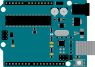
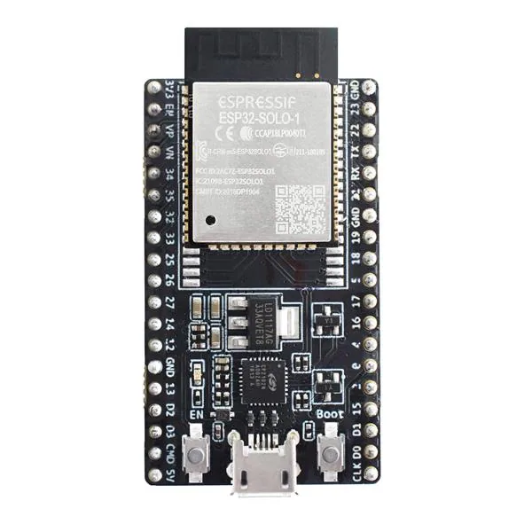

# Microcontrollers

Microcontrollers are small computers designed to control hardware directly. A program is stored in non-volatile memory and normally starts running as soon as the device powers up.

They are well suited to reading buttons and sensors, producing precisely timed outputs, controlling LEDs, communicating with other chips, and operating embedded devices.

## Microcontroller, development board, or SBC?

| Term | Meaning |
| --- | --- |
| Microcontroller | The integrated circuit containing the processor, memory, and peripherals |
| Development board | A board that makes a microcontroller easier to power, program, and connect |
| Single-board computer | A complete computer that normally runs an operating system |

An ATmega328P is a microcontroller. An Arduino Uno R3 is a development board containing one. An ESP32-C6 is a microcontroller commonly supplied on a development board. A Raspberry Pi 5 is a single-board computer.

*Figure: An Arduino Uno — a beginner-friendly development board.*

*Figure: An ESP32 board, which adds Wi-Fi and Bluetooth.*

*Figure: A Raspberry Pi — a full single-board computer that runs an operating system.*

## Common microcontroller features

- Digital inputs and outputs
- Analogue-to-digital converters
- Timers and PWM outputs
- UART, I²C, and SPI communication
- Interrupts
- Flash program memory and RAM
- Watchdogs and low-power modes
- Wireless hardware on some devices

## Choosing a board

Consider:

- Logic voltage: commonly `5 V` or `3.3 V`
- Number and type of GPIO pins
- Analogue inputs and true analogue outputs
- Timers and PWM channels
- Memory and processing requirements
- Wi-Fi, Bluetooth, Zigbee, or Thread requirements
- Available libraries and documentation
- Debugging and programming interfaces
- Power consumption

{: .warning}
> GPIO pins are logic connections, not general-purpose power supplies. Use resistors with LEDs and driver circuits for motors, relays, heaters, and other loads.

## GPIO modes

A GPIO pin may be configured as:

- **Input:** reads an external logic level
- **Input pull-up/pull-down:** reads a signal while an internal resistor provides a default state
- **Output:** drives a digital high or low
- **PWM:** rapidly switches to approximate variable power
- **Peripheral function:** used by UART, I²C, SPI, or another hardware block
- **Analogue input:** feeds an ADC where supported

Never assume every pin supports every function. Check the board pinout and chip documentation.

## Recommended guides

- [Arduino Uno R3](03_03_ArduinoUnoR3.md) — beginner-friendly `5 V` development board
- [ESP32-C6](03_04_ESP32C6.md) — `3.3 V` wireless microcontroller platform
