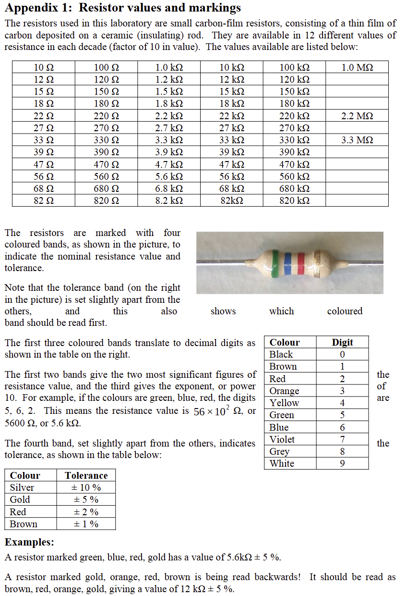

# Resistors

A resistor limits current, divides voltage, sets bias conditions, and defines logic states. Resistance is measured in ohms (`Ω`).

## Ohm's law

```text
V = I × R
I = V / R
R = V / I
```

For a `5 V` supply and LED with a `2 V` forward drop at `10 mA`:

```text
R = (5 V - 2 V) / 0.010 A = 300 Ω
```

Choose the next suitable standard value, such as `330 Ω`.

## Power rating

```text
P = V × I
P = I² × R
P = V² / R
```

Choose a resistor with a rating comfortably above the calculated dissipation. Stop if a resistor becomes unexpectedly hot or discoloured.

## Reading a resistor

Through-hole resistors often use coloured bands for significant digits, multiplier, and tolerance. Confirm uncertain values with a multimeter before installing them.



*Figure: Resistor colour-code guidance retained from **EEEN20020** teaching material.*

## Common uses

- LED current limiting
- Pull-up and pull-down resistors
- Voltage dividers
- Transistor bias and gate resistors
- Current sensing

{: .warning}
> Never replace a resistor with a lower value merely to make something brighter. Recalculate current and power first.

## Series and parallel

```text
series:   Rtotal = R1 + R2 + ...
parallel: 1/Rtotal = 1/R1 + 1/R2 + ...
```

The equivalent resistance of parallel resistors is always lower than the smallest branch resistance.

## Check before power

- Confirm the value and tolerance.
- Check the power rating.
- Make sure the leads are not shorted together on the breadboard.
- Verify that the resistor is actually in series with the intended load.

- [DigiKey resistor colour-code calculator](https://www.digikey.ie/en/resources/conversion-calculators/conversion-calculator-resistor-color-code)
