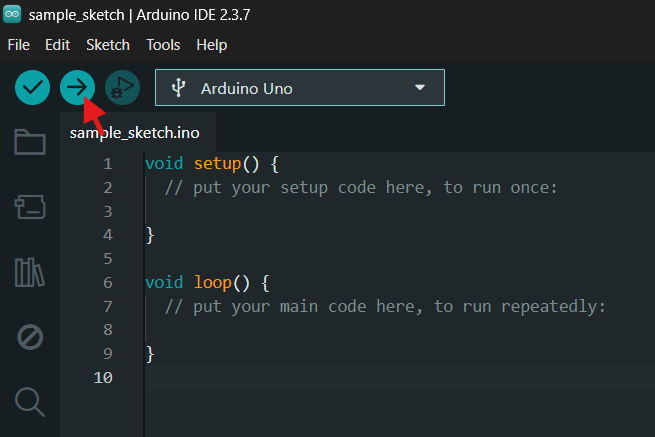
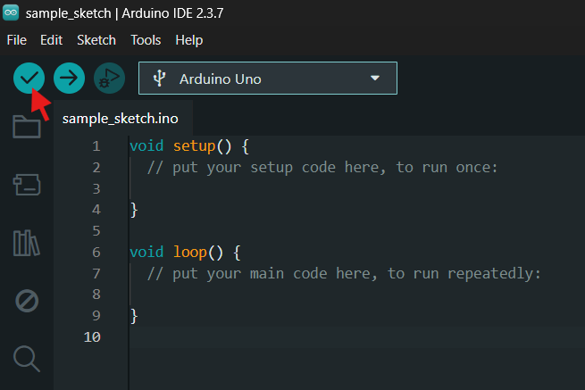

# Arduino IDE

Arduino IDE is used to write, verify and upload programs called **sketches**. It also includes a Serial Monitor, Serial Plotter, board manager and library manager.

## Install it

1. Download the current stable Arduino IDE from the [official Arduino software page](https://www.arduino.cc/en/software).
2. Install it using the normal method for Windows, macOS or Linux.
3. Open the IDE and allow any requested driver installation.

On a managed university computer, the IDE may already be installed. Do not install random driver packages from unofficial download sites.

## Connect an Arduino Uno

1. Connect the board using a **data-capable** USB cable.
2. Select the board and port from the board selector.
3. If needed, choose **Tools > Board > Arduino AVR Boards > Arduino Uno**.
4. Open **File > Examples > 01.Basics > Blink**.
5. Select **Verify**, then **Upload**.

## Add another board

Boards such as the ESP32-C6 need a board package:

1. Open **Tools > Board > Boards Manager**.
2. Search for the manufacturer or board family.
3. Install the package from the expected publisher.
4. Select the exact board model.

For ESP32 boards, use the package published by **Espressif Systems**.

## Install a library

1. Open **Tools > Manage Libraries**.
2. Search for the library name.
3. Check the publisher and examples before installing.
4. Include it with a line such as `#include <Servo.h>`.

## Serial tools

`Serial.begin(115200);` in the sketch must match the baud rate selected in Serial Monitor or Serial Plotter.

- **Serial Monitor:** text commands and debugging
- **Serial Plotter:** numerical values graphed over time

Only one program can normally use a serial port at a time. Close other serial tools if uploading fails.

Official reference: [Arduino IDE documentation](https://docs.arduino.cc/software/ide/).
