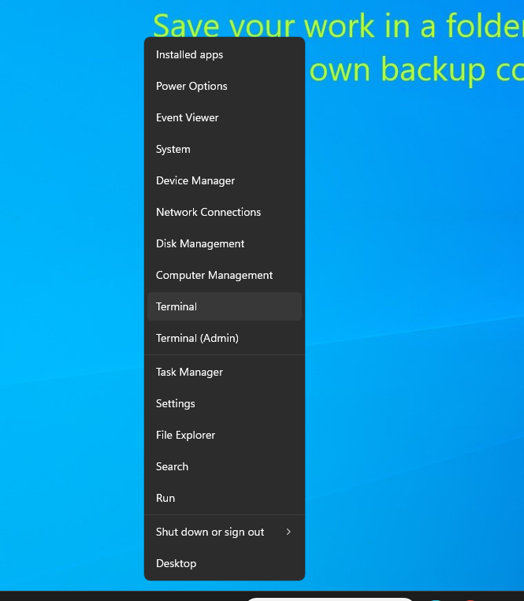
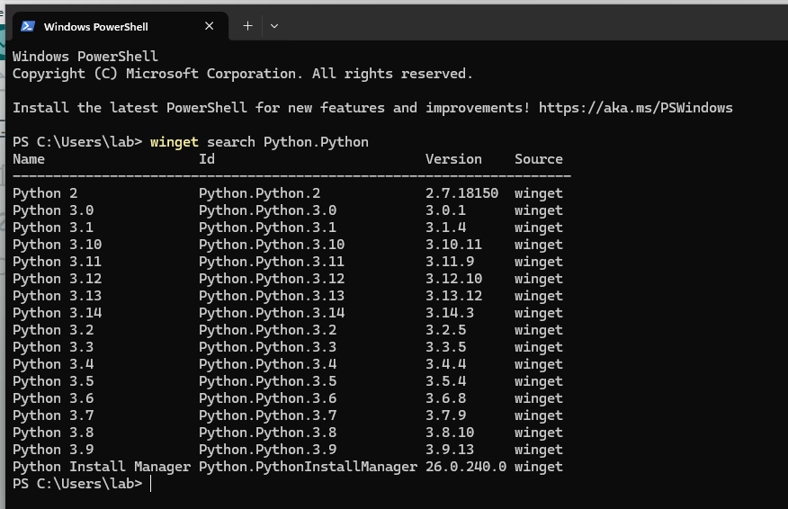
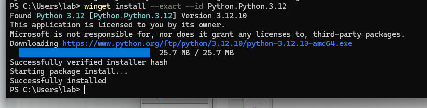
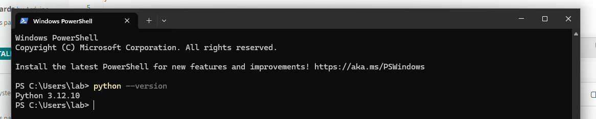
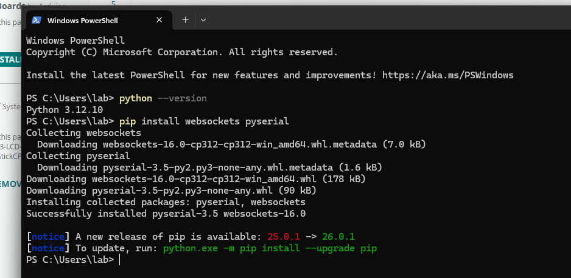

# Python
*Please note, if you already have Python installed and know how to use it, you do not need to read this. This is a **beginners guide to installing Python only***

Python is a high-level programming language used for scripting, automation, and backend tooling.

For Makerthon26, Python is used to run a **local WebSocket bridge** that connects:

- Your Arduino (via USB Serial)
- Your browser app (Lovable) via WebSocket

The bridge simply translates messages between hardware and the web app.

---

# Setting up Python

This guide is for **Windows users**.

We recommend installing Python using PowerShell so that it is automatically added to your system PATH.

---

## Step 1 – Open Powershell (PowerShell Method)
*Note: You must be connected to the internet. If any issues, contact us for help.*

   - Press `Win + X`
   - Click **Windows Terminal* / **Terminal** / **PowerShell** 

---

## Step 2 – Search for Python installs using `winget` command:
    - Run `winget search Python.Python`
    - You should see a list of available python versions to download

---

## Step 3 - Install a Python version
   - We're installing **Python v3.12**
   - Run `winget install --exact --id Python.Python.3.12` (*Note: the `--exact` and `--id` just makes sure there is no name conflicts*)
   - When prompted, type `Y` to accept conditions
   - Python will be installed succesfully and PATH variable updated automatically.

---

## Step 4 - Verify installation
   - **Close** PowerShell first (*we have to relaunch the terminal because it needs to refresh PATH Variables*)
   - Reopen PowerShell according to step 1
   - Run the command `python --version`
   - It should output "3.12.10" or something similar

---

## Step 5 - Install dependencies for this Makerthon
   - Run `pip install websockets pyserial`
   - It should install **websocket** and **pyserial** libraries

---

# You're done!