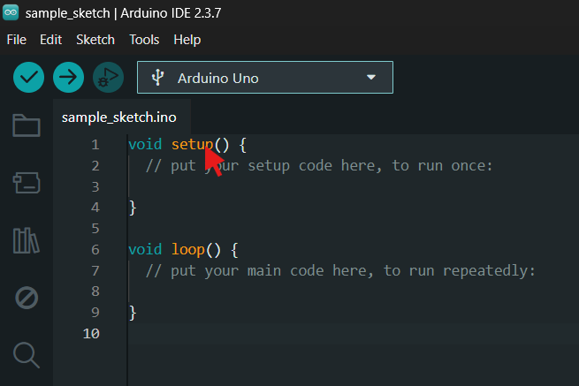
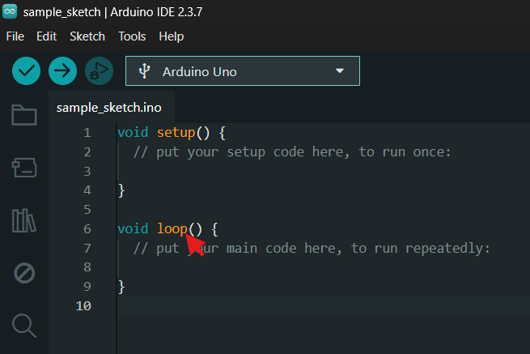

# Arduino Program Structure

Every Arduino sketch starts with two functions:

```cpp
void setup() {
  // Runs once after power-up or reset.
}

void loop() {
  // Repeats for as long as the board is running.
}
```

## `setup()`

Use `setup()` to configure things once:

```cpp
const int ledPin = 13;

void setup() {
  pinMode(ledPin, OUTPUT);
  Serial.begin(115200);
}
```



## `loop()`

Use `loop()` for repeated behaviour:

```cpp
void loop() {
  digitalWrite(ledPin, HIGH);
  delay(500);
  digitalWrite(ledPin, LOW);
  delay(500);
}
```



## Code outside the functions

Constants, variables, included libraries and function definitions can appear outside `setup()` and `loop()`. Actions such as `digitalWrite()` normally belong inside a function.

```cpp
#include <Servo.h>

const int servoPin = 9;
Servo arm;

void centreArm() {
  arm.write(90);
}
```

## Comments

```cpp
// One-line comment

/*
  Multi-line comment
*/
```

Comments should explain intent or a non-obvious decision, not repeat every line.
