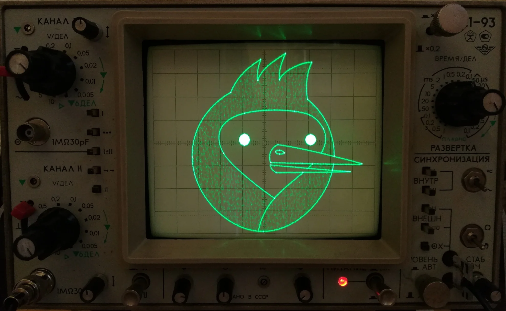

# Workshop 04 - Good Waves, Bad Vibes

Learn how engineers stop guessing and start seeing signals change over time. At home, you will use the free Arduino Serial Plotter. If you are in the electronics lab, you can repeat the same ideas with an oscilloscope.

## What you need at home

- An Arduino Uno-compatible board and USB cable
- A potentiometer or photoresistor
- One `10 kΩ` resistor if you use a photoresistor
- A breadboard and jumper wires
- The Arduino IDE and its built-in Serial Plotter

No hardware yet? Build the potentiometer circuit in Tinkercad and use its Serial Monitor to inspect the readings.

## What you will learn

- Sample an analogue signal
- Plot a signal against time
- Recognise noise and smooth measurements
- Estimate a waveform's period and frequency
- Understand what an oscilloscope adds to the process

## Workshop route

### Core tasks

1. [Task 1 - Plot and clean a signal](SerialPlotter.md)
2. [Task 2 - Measure period and frequency](Frequency.md)
3. [Task 3 - Compare filtering methods](Filtering.md)

### Advanced tasks

4. [Advanced Task 1 - Characterise a signal with an oscilloscope](Oscilloscope.md)
5. [Advanced Task 2 - Decode a noisy message](SignalDecoder.md)

An oscilloscope is an optional extension, not a requirement.

