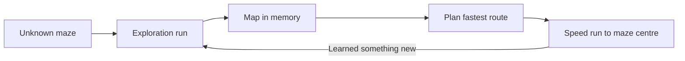
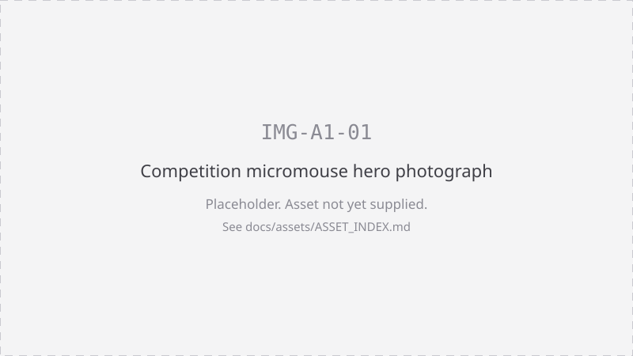

# What is Micromouse?

> A small self-driving robot is placed in a maze it has never seen. Nobody touches
> it again. It must find its own way to the maze centre, work out the best route,
> then drive that route as fast as it can.

That is the whole sport. Everything else is detail.

## The four beats

| Beat | What the micromouse is doing |
|---|---|
| **Explore** | Drive the unknown maze, feel for walls with its sensors |
| **Understand** | Build a map in memory from what it sensed |
| **Optimise** | Compute the fastest route from start to maze centre |
| **Race** | Return to the start and run that route flat out: the speed run |

## No human input once started

You press start. After that:

- No remote control, no steering, no nudging.
- The micromouse decides everything on board.
- Your work happens before the run, in the hardware and the code.

## What the robot actually needs to do

**Sensing.** Distance sensors look left, right and ahead to answer one question per
cell: is there a wall there? An IMU and motor encoders tell it how far it has
travelled and how much it has turned.

**Mapping.** Each answer is stored against a cell in a grid held in memory. After
enough cells, the micromouse has a map.

**Route planning.** A flood fill algorithm is the classic beginner choice. Number
every cell by its distance from the maze centre, then always step downhill. Simple
to write, and it works.

**Control.** Motors do not obey neatly. Wall following, encoder counts and the IMU
are combined so the micromouse drives straight, turns a known amount and stops
where it meant to stop.

**Speed run.** Once the map is good, the micromouse stops searching and commits.
Faster straights, tighter turns, and on some mazes, diagonals.

<!-- VIDEO EMBED: VID-A1-01 goes here. 60 to 90 second clip of a micromouse
     exploration run followed by a speed run. Replace this comment with the
     embed markup at publish time. -->

*Video VID-A1-01: an exploration run and a speed run, side by side.*

*IMG-A1-01: a micromouse in a maze cell, sensors facing the walls.*

## Where it came from

IEEE Spectrum announced the Amazing Micro-Mouse Maze Contest in 1977, and the
first contest ran in New York in June 1979. Delegates took the rules to Tokyo and
the first All Japan Micromouse Contest was held in November 1980, where no mouse
reached the centre. The discipline has run continuously ever since and is now
international, including the long-running APEC Micromouse Contest in the USA.
Nearly fifty years on, the challenge is unchanged.

## Is this suitable for a beginner?

Yes. It is designed to be.

- No robotics experience is required.
- Every team gets the same kit, so nobody starts ahead on hardware.
- A 30 minute opening briefing covers the electronics, GitHub basics and
  maze-solving strategies.
- A pre-recorded video series and written setup documentation are published in
  advance.
- ElecSoc committee members and postgraduate demonstrators are on the floor all
  day.

A micromouse that crawls to the centre has done the hard part. Speed is the part
you add afterwards.

---

[Competitor documentation home](index.md) · Previous: none · Next: [A2 Competition format](02-competition-format.md)

Related: [A3 Rules and scoring](03-rules-and-scoring.md)
