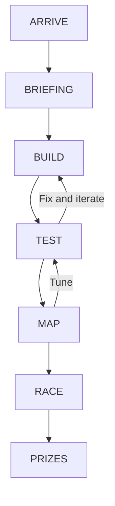

# Competition format

> **You get six hours. You get the same starting kit as everyone else. You build
> the mouse on the day.**

Dublin Micromouse Open 2026 runs on Saturday 26 September 2026 at UCD Village,
University College Dublin, hosted by UCD ElecSoc.

> **A slow mouse that successfully solves the maze is still a successful build.**
> Finishing beats not finishing. Optimise afterwards.

## The build sprint

- One six-hour build window, same day, from nothing to a running micromouse.
- Identical modular kit per team, so the contest is about your build and your
  code.
- No experience assumed. The day opens with a 30 minute briefing covering the
  electronics, GitHub basics and maze-solving strategies.
- Preparation material, a pre-recorded video series plus written setup
  documentation, is published in advance. Do the setup before you arrive: see
  [A6 Laptop setup](06-laptop-setup.md).

## Shape of the day

Sequence is fixed. Clock times are not.

`[INFO REQUIRED: confirmed running order and start/finish times]`

| Stage | What happens |
|---|---|
| ARRIVE | Sign in, collect kit, find your bench |
| BRIEFING | 30 minutes: electronics, GitHub, maze-solving strategies |
| BUILD | Assemble the kit, get motors and sensors alive |
| TEST | Practice mazes, straight-line driving, turns, wall detection |
| MAP | Exploration runs, flood fill, route planning |
| RACE | Verified runs on the competition maze |
| PRIZES | Awards and close |

`[INFO REQUIRED: exact room within UCD Village]`

## Teams

`[DECISION REQUIRED: team size, minimum and maximum]`

`[INFO REQUIRED: registration mechanism, opening date, closing date and fee]`

## Supplied equipment

Every team receives the same kit:

- ESP32 microcontroller
- Encoded motors and motor driver
- IMU
- Distance sensors
- Battery management system, buck converter and battery pack

Tools and mentors:

- **Tools.** Bench tools and soldering provision are on site.
  `[INFO REQUIRED: confirmed list of shared tools and soldering stations]`
- **Mentors.** ElecSoc committee members and postgraduate demonstrators are on the
  floor all day. Ask early, not at hour five.

## Competitor equipment

Bring your own laptop, set up in advance per
[A6 Laptop setup](06-laptop-setup.md). Full packing list is in
[A8 Venue, travel and what to bring](08-venue-and-what-to-bring.md).

`[DECISION REQUIRED: whether teams may bring their own components or tools]`

`[DECISION REQUIRED: whether pre-event code is permitted, and any starter repository URL]`

## Mazes

| Maze | Purpose | Availability |
|---|---|---|
| Full size practice maze | Realistic testing before you compete | Open all day |
| Mini practice mazes | Quick iteration on turns and wall detection | Open all day |
| Mini diagonal maze | Built so the fastest route cuts diagonals: a path-smoothing target for teams who get ahead | Open all day |
| Competition maze | Verified runs only | Race stage |

The diagonal maze is the stretch goal. Solve the maze first, smooth the path
second.

`[INFO REQUIRED: maze dimensions, cell size, wall height, wall thickness and post size]`

Runs, timing, penalties and scoring are not covered here. See
[A3 Rules and scoring](03-rules-and-scoring.md).

## Food

`[INFO REQUIRED: catering, meal times and dietary request process]`

## Prizes

- **Fastest verified run to the maze centre** is the main award.
- **Design** and **reliability** awards are also given.
- Anthropic, technical partner, provides a credits package for the winning team.

`[DECISION REQUIRED: design and reliability award criteria]`

`[INFO REQUIRED: prize list beyond the Anthropic credits package]`

`[DECISION REQUIRED: Anthropic credits redemption mechanism, value and expiry, and whether credits go to all teams or the winning team only]`

## Sponsors

Anthropic is the technical partner and the UCD School of Electrical and Electronic
Engineering supports the event. Full credits and tiers are in
[A7 Sponsor credits](07-sponsor-credits.md).

---

[Competitor documentation home](index.md) · Previous: [A1 What is Micromouse?](01-what-is-micromouse.md) · Next: [A3 Rules and scoring](03-rules-and-scoring.md)

Related: [A6 Laptop setup](06-laptop-setup.md) · [A8 Venue, travel and what to bring](08-venue-and-what-to-bring.md) · [A7 Sponsor credits](07-sponsor-credits.md)
