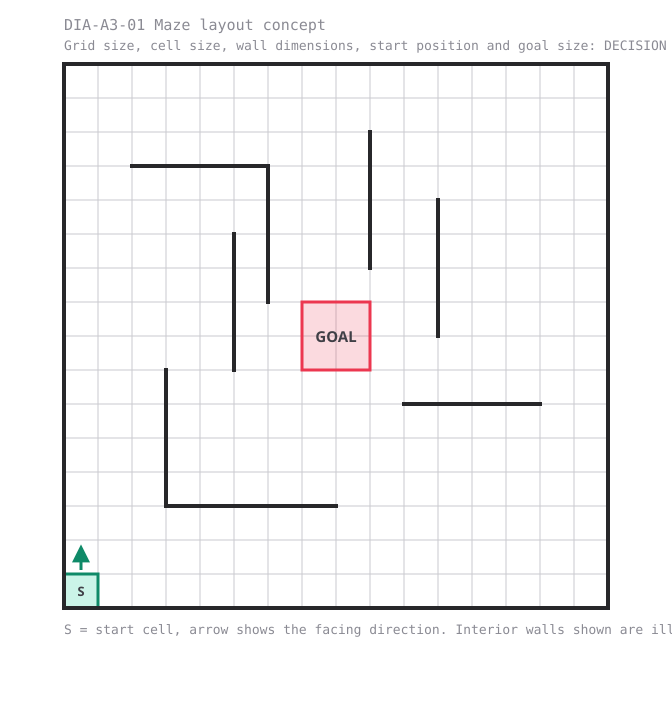
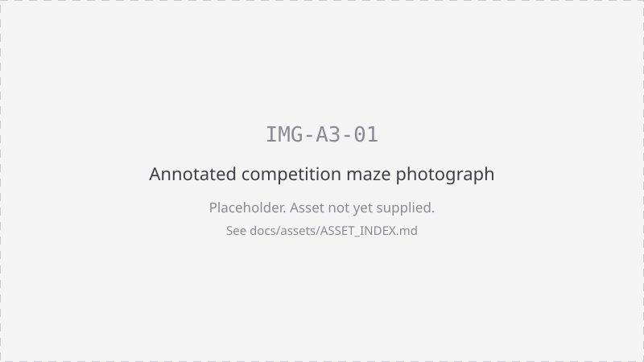
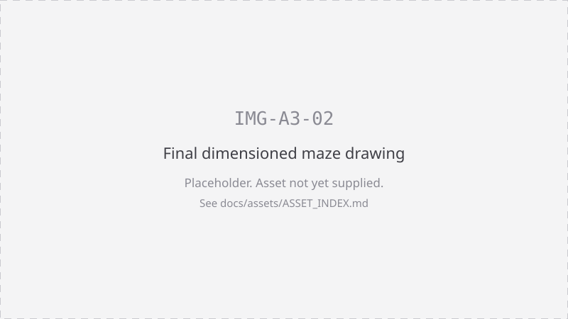
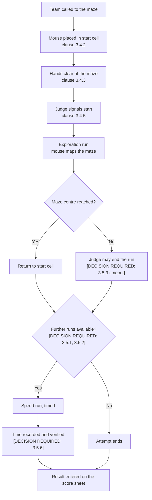

# Rules and scoring

This is the document a judge cites out loud to settle a disagreement on the day.
Cite clauses by number, for example "clause 3.6.1".

Shared event facts come from [EVENT_FACTS.md](../EVENT_FACTS.md). Where a rule has
not yet been decided by the organising committee, the clause reads
`[DECISION REQUIRED: ...]` and is **not** enforceable until it is filled in.
Nothing in this page may be inferred from the reference section at the end.

> **Status: blocked.** Every measurement, run limit, penalty, scoring formula and
> tie breaker on this page is still undecided. See
> [Decisions still required](#decisions-still-required).

---

# Decisions still required

| Clause | Decision | Why it matters | Blocks |
|---|---|---|---|
| 3.1.3 | Team size, minimum and maximum | Judges cannot rule on an oversized team at the maze | A2, A5 registration |
| 3.1.4 | Eligibility beyond "undergraduates and anyone else" | Entry disputes at sign-in | A5 registration |
| 3.2.1 | Maximum micromouse footprint and any height limit | A mouse that will not fit the maze must be caught before it runs | A8 packing, B kit docs |
| 3.2.3 | Whether teams may bring their own components or tools | Parity between teams is the core fairness claim | A8 packing |
| 3.3.1 | Maze cell size, grid size and overall footprint | Every navigation algorithm depends on it | B firmware, venue plan |
| 3.3.2 | Wall height, wall thickness and post size | Sensor calibration and wall following | B sensor docs |
| 3.3.3 | Start cell position and orientation | Where the mouse is placed and which way it faces | 3.4, firmware defaults |
| 3.3.4 | Goal area size and position | Defines "reached the maze centre" | 3.5, 3.8 |
| 3.3.6 | Whether the diagonal mini maze is scored or practice only | Whether teams should optimise for diagonals | A2 |
| 3.4.4 | Permitted contents of the start cell and any pre-run alignment aids | Consistency of start conditions | 3.5 |
| 3.5.1 | Number of runs permitted per team | Team strategy for the whole day | A2 running order |
| 3.5.2 | Total time on the maze per team | Schedule capacity of the event day | A2 running order |
| 3.5.3 | Timeout per individual run | When a judge may end a stuck run | 3.10 |
| 3.5.5 | Whether exploration run time is counted or penalised | Whether to explore fully or dash | 3.8 |
| 3.5.6 | Timing method and who operates it | What "verified" means for the main award | 3.8, 3.11 |
| 3.6.2 | Handling and touch penalties | The most argued rule at any Micromouse event | 3.8 |
| 3.6.3 | Whether a touched run may still be scored | Whether a crash ends a team's attempt | 3.8 |
| 3.7.4 | Whether pre-event code is permitted, and any starter repository URL | Determines what teams may prepare in advance | A4, A6 |
| 3.8.1 | Scoring formula for the main award | The award itself | 3.9 |
| 3.8.4 | Tie breakers | Two identical times is a real outcome | 3.9 |
| 3.9.2 | Design award criteria and judging panel | Teams cannot aim at an undefined target | A2 |
| 3.9.3 | Reliability award criteria | As above | A2 |
| 3.9.4 | Prize list beyond the Anthropic credits package, and credits redemption, value, expiry and recipients | Prize claims made in public must be accurate | A7 |
| 3.10.2 | Disqualification grounds and who may impose one | Due process | 3.11 |
| 3.11.1 | Appeals route, time limit and final arbiter | Disputes must end somewhere | all |
| 3.12.2 | Battery handling, charging and fault procedure | Safety of the venue and competitors | A8, B kit docs |

Every marker on this page is also recorded in
[audits/HUMAN_DECISIONS_REQUIRED.md](../audits/HUMAN_DECISIONS_REQUIRED.md).

---

## 3.1 Robot eligibility

3.1.1 Every team competes with the identical modular kit issued by the organisers
on the day. No other mouse may be entered.

3.1.2 The mouse must be built during the six hour build window on the day of the
Open. Hardware assembled in advance is not eligible.

3.1.3 [DECISION REQUIRED: team size, minimum and maximum.] Decision involves
setting a floor and a ceiling on registered competitors per team and how a judge
handles a team that arrives short or over.

3.1.4 [DECISION REQUIRED: eligibility beyond "undergraduates and anyone else who
wants a go".] Decision involves whether postgraduates, staff, alumni and
non-students may compete for awards or enter exhibition only.

3.1.5 The mouse must be autonomous. Once a run starts there is no human input of
any kind.

3.1.6 The mouse must carry its own power and its own sensing. No off-board
computation, no external sensing, no remote link during a run.

## 3.2 Dimensions and construction

3.2.1 [DECISION REQUIRED: maximum micromouse footprint and any height limit.]
Decision involves a single square footprint figure measured with the mouse on the
maze floor, plus whether height is limited at all.
*Commonly used elsewhere, NOT yet our rule: a 25 cm square footprint with no
height limit. See [For reference](#for-reference-international-convention).*

3.2.2 The kit is ESP32 based. The supplied microcontroller, motors, motor driver,
IMU, distance sensors, battery management system, buck converter and battery pack
are the permitted electronics.

3.2.3 [DECISION REQUIRED: whether teams may bring their own components, materials
or tools.] Decision involves the parity rule: identical kit for every team is the
event's core fairness claim, so any exception must be written down.

3.2.4 The mouse may not damage, mark or alter the maze in any way.

3.2.5 The mouse may not lay, drop or leave anything in the maze, and may not jump
over or climb a wall.

## 3.3 The maze

3.3.1 [DECISION REQUIRED: maze cell size, grid size and overall footprint.]
Decision involves the physical maze being built for the Open and must be fixed
before firmware documentation is published.

3.3.2 [DECISION REQUIRED: wall height, wall thickness and post size, with
tolerance.] Decision involves what the distance sensors will actually see.

3.3.3 [DECISION REQUIRED: start cell position and orientation.] Decision involves
which corner the start cell occupies, which walls it has, and the direction the
mouse faces at the start.

3.3.4 [DECISION REQUIRED: goal area size and position.] Decision involves how many
cells count as the maze centre and how a judge decides the mouse is inside it.

3.3.5 Full size and mini practice mazes are open all day for practice.

3.3.6 [DECISION REQUIRED: whether the diagonal mini maze is used for scored runs
or practice only.] Decision involves whether the mini maze built so the fastest
route cuts diagonals affects any award.

### Maze layout concept

Dimensions in the figure are illustrative only and are governed by clauses 3.3.1
to 3.3.4.

*DIA-A3-01: maze layout concept. Grid and cell dimensions are not yet decided, see clauses 3.3.1 to 3.3.4.*

*IMG-A3-01: annotated photograph of the competition maze. Pending build.*

*IMG-A3-02: final dimensioned maze drawing. Blocked on clauses 3.3.1 to 3.3.4.*

## 3.4 Starting procedure

3.4.1 A team is called to the maze by a judge and must present the mouse ready to
run.

3.4.2 The mouse is placed by the team in the start cell, positioned as required by
clause 3.3.3.

3.4.3 All hands must be clear of the maze before the run begins. The judge
confirms hands clear.

3.4.4 [DECISION REQUIRED: permitted contents of the start cell and any pre-run
alignment aids.] Decision involves whether a jig, marker or physical alignment aid
may be used to place the mouse.

3.4.5 The run begins only on the judge's signal. A mouse that moves before the
signal is stopped and replaced in the start cell.

3.4.6 Once the run has begun, no competitor may touch the mouse or the maze except
as allowed under clause 3.6.

### Run procedure

## 3.5 Runs and timing

3.5.1 [DECISION REQUIRED: number of runs permitted per team.] Decision involves
how many attempts a team gets at the maze in total.
*Commonly used elsewhere, NOT yet our rule: a fixed cap of five runs. See
[For reference](#for-reference-international-convention).*

3.5.2 [DECISION REQUIRED: total time on the maze per team.] Decision involves a
single block of maze time within which all runs must happen.
*Commonly used elsewhere, NOT yet our rule: 7 to 10 minutes of maze time per team.
See [For reference](#for-reference-international-convention).*

3.5.3 [DECISION REQUIRED: timeout per individual run.] Decision involves when a
judge may declare a single run over.

3.5.4 A run ends when the mouse reaches the maze centre, when the team retires the
run, or when a judge ends it under clause 3.5.3 or clause 3.10.

3.5.5 [DECISION REQUIRED: whether exploration run time is counted, weighted or
ignored in the score.] Decision involves whether a team is rewarded for exploring
quickly as well as running quickly.
*Commonly used elsewhere, NOT yet our rule: adding a fraction of the first run's
time as a search penalty. See [For reference](#for-reference-international-convention).*

3.5.6 [DECISION REQUIRED: timing method and who operates it.] Decision involves
what makes a run "verified" for the purposes of the main award under clause 3.8.2,
and who holds the timing device.

3.5.7 The team may retire a run at any time by asking the judge to stop it. The
judge's stop is the end of the run.

## 3.6 Handling and interference

3.6.1 A competitor may only touch the mouse during a run with the judge's
permission, and touching ends that run.

3.6.2 [DECISION REQUIRED: handling and touch penalties.] Decision involves what a
touch costs, in added time or in a voided run.
*Commonly used elsewhere, NOT yet our rule: a fixed time penalty added to the
score, or the touched run being excluded from scoring. See
[For reference](#for-reference-international-convention).*

3.6.3 [DECISION REQUIRED: whether a touched or crashed run may still be scored.]
Decision involves whether a crash ends the attempt or simply ends that run.

3.6.4 No person may touch, lean on, adjust or obstruct the maze during any run.

3.6.5 Deliberate interference with another team's mouse, code or run is grounds
for disqualification under clause 3.10.

3.6.6 If a judge, an official or a spectator interferes with a run, the judge
shall void the run and the team may take it again.

## 3.7 Software and AI coding agents

3.7.1 The mouse operates autonomously. No human input of any kind is permitted
once a run has started, including remote commands, tethers and manual triggers
after the start signal.

3.7.2 AI coding agents may be used to write, debug and refactor the team's code
during the build window, subject to
[A4 AI coding agent policy](04-ai-agent-policy.md).

3.7.3 An AI coding agent may not be in the loop during a run. Clause 3.7.1 applies
to agents exactly as it applies to people.

3.7.4 [DECISION REQUIRED: whether code written before the event is permitted, and
whether a starter repository is provided.] Decision involves how much preparation
a team may bring, and must be published before registration closes.

3.7.5 The team must be able to explain their code to a judge on request. Inability
to explain a submitted solution may be considered under clause 3.9 and clause
3.10.

3.7.6 Teams should keep their work in version control. Commit history may be used
as evidence in a dispute under clause 3.11.

## 3.8 Scoring

3.8.1 [DECISION REQUIRED: scoring formula for the main award.] Decision involves
how run time, penalties and any search component combine into a single number.

3.8.2 The main award goes to the fastest verified run to the centre of the maze.

3.8.3 A run that does not reach the maze centre does not produce a time for the
main award.

3.8.4 [DECISION REQUIRED: tie breakers.] Decision involves the ordered list of
tests applied when two teams record the same result.

3.8.5 Scores are recorded on the official score sheet by the judge at the maze.
The score sheet is the record of the event.

## 3.9 Awards

3.9.1 The main award is for the fastest verified run to the centre of the maze, in
accordance with clause 3.8.

3.9.2 [DECISION REQUIRED: design award criteria and judging panel.] Decision
involves what is judged, by whom, and when.

3.9.3 [DECISION REQUIRED: reliability award criteria.] Decision involves how
reliability is measured across a team's runs.

3.9.4 [DECISION REQUIRED: prize list beyond the Anthropic credits package, and the
credits redemption mechanism, value, expiry and whether credits go to the winning
team only or to all teams.] Decision involves claims made publicly by the event and
its technical partner.

3.9.5 Anthropic is the technical partner of the Open and provides a credits
package for the winning team. See [A7 Sponsors and partners](07-sponsor-credits.md).

## 3.10 Disqualification

3.10.1 A judge may end a run immediately if the mouse or the team creates a safety
risk, damages the maze or interferes with another team.

3.10.2 [DECISION REQUIRED: full grounds for disqualification and who may impose
one.] Decision involves the list of offences, who decides, and whether the decision
is from a single run or from the whole competition.

3.10.3 Entering a mouse that is not the issued kit, or that was built outside the
six hour build window, voids the entry under clauses 3.1.1 and 3.1.2.

3.10.4 Any breach of [A9 Code of conduct](09-code-of-conduct.md) is handled under
that document and may result in removal from the competition.

## 3.11 Disputes and appeals

3.11.1 [DECISION REQUIRED: appeals route, time limit for lodging an appeal, and
the final arbiter.] Decision involves who hears an appeal and how quickly it must
be raised for the day to keep running.

3.11.2 A dispute is raised with the judge at the maze first, at the time of the
run. A result cannot be disputed after the awards.

3.11.3 The judge's ruling stands while the run continues. Disputes are settled
between runs, not during them.

3.11.4 Judges rule from this document. A rule that reads
`[DECISION REQUIRED: ...]` is not enforceable, and the judge shall rule in the way
that is fairest to all teams and record what they did.

## 3.12 Safety

3.12.1 Competitors must follow the instructions of ElecSoc committee members,
postgraduate demonstrators and venue staff at all times.

3.12.2 [DECISION REQUIRED: battery handling, charging and fault procedure for the
supplied battery pack and battery management system.] Decision involves storage,
charging locations, what to do with a hot or swollen pack, and who to tell.

3.12.3 A mouse that is smoking, overheating, sparking or otherwise unsafe must be
powered down immediately and reported to floor support.

3.12.4 Soldering, cutting and any powered tools are used only in the designated
build area and only as instructed at the briefing.

3.12.5 Keep gangways and the area around the maze clear. Nothing is placed on the
maze table other than a mouse being run.

---

# For reference: international convention

> **This section is NOT the rules of the Dublin Micromouse Open 2026.**
> Nothing below is binding. It is background on how Micromouse is commonly run
> internationally, gathered so the committee can decide what to adopt. A judge
> must not cite anything in this section. Our rules are clauses 3.1 to 3.12 above.

**Classic maze.** 16 x 16 cells of 18 cm square, walls 5 cm high and 1.2 cm thick,
typically with a 5% tolerance. Wall sides white, wall tops red, floor black.

**Start and goal.** The start cell sits in one corner with walls on three sides,
and the mouse departs clockwise. The goal is a four cell area at the centre.

**Half size class.** 9 cm cells on a grid up to 32 x 32, walls 2.5 cm high and
0.6 cm thick, giving 8.4 cm passageways.

**Mouse size.** Commonly a 25 cm square footprint measured with the mouse on the
maze floor, with no height limit, and the mouse fully self contained with onboard
sensing.

**Run limits and penalties.** IEEE student competitions commonly give 10 minutes
in the maze with unlimited runs, scoring the fastest untouched run. APEC commonly
gives 7 minutes and a maximum of five runs, adds a search penalty of one thirtieth
of the first run's time, and adds a 2 second penalty for a crash.

Sources: [UB IEEE competition rules](https://ubieee.github.io/wiki/micromouse/competition-rules/),
[IEEE R2 SAC MicroMouse rules 2020 (PDF)](https://attend.ieee.org/r2sac-2020/wp-content/uploads/sites/175/2020/01/MicroMouse_Rules_2020.pdf),
[Marshall University IEEE MicroMouse rules 2023 (PDF)](https://www.marshall.edu/cecs/files/MicroMouse_Rules_2023.pdf),
[UKMARS half size rules](https://ukmars.org/contests/contest-rules/micromouse-half-size/),
[Micromouse, Wikipedia](https://en.wikipedia.org/wiki/Micromouse).

---

[Competitor documentation home](index.md) · Previous: [A2 Competition format](02-competition-format.md) · Next: [A4 AI coding agent policy](04-ai-agent-policy.md)

Related: [A4 AI coding agent policy](04-ai-agent-policy.md) · [A2 Competition format](02-competition-format.md)
