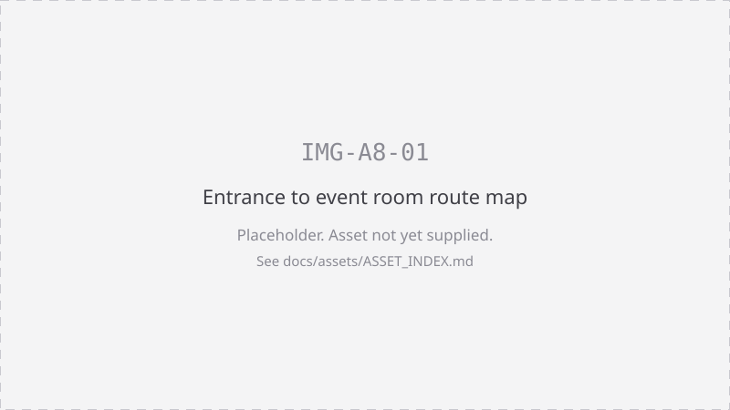
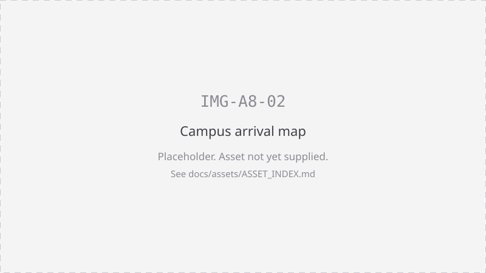

# Venue, travel and what to bring

| | |
|---|---|
| **Date** | Saturday 26 September 2026 |
| **Venue** | UCD Village, University College Dublin, Belfield, Dublin 4 |
| **Room** | [INFO REQUIRED: exact room within UCD Village] |
| **Doors and start** | [INFO REQUIRED: arrival, briefing and start times] |
| **Finish** | [INFO REQUIRED: finish time of the event day] |
| **On the day contact** | [INFO REQUIRED: on-the-day contact number] |
| **Email** | eleceng@ucdsocieties.ie |

This page is the single home of the packing list. Other pages link here.

# Bring

Tick this the night before, not on the morning.

**Essential**

- [ ] Laptop, set up as described in [A6 Laptop setup](06-laptop-setup.md)
- [ ] Laptop charger
- [ ] **USB data cable** for your laptop's ports to the ESP32. A charge-only
      cable will not work. See [A6 Laptop setup](06-laptop-setup.md)
- [ ] USB-C or USB-A adapter if your laptop has only one port type
- [ ] Student card or photo ID
- [ ] Phone and phone charger
- [ ] Water bottle, refillable
- [ ] Your team name and the names of everyone on your team

**Strongly recommended**

- [ ] Extension lead or multi-plug, so your team shares one socket
- [ ] Notebook and pen
- [ ] Headphones
- [ ] Small torch or phone torch for looking into the maze
- [ ] Jumper or hoodie. Rooms run cold
- [ ] Snacks you actually like
- [ ] Any medication you need during a long day

**Optional, subject to a decision**

- [ ] Your own tools, such as a screwdriver set, side cutters, tweezers,
      multimeter
- [ ] Your own components or spares

[DECISION REQUIRED: whether teams may bring their own components or tools. Until
this is confirmed, assume you must build from the supplied kit only and bring
nothing electrical of your own.]

**Do not bring**

- Soldering irons, hot air stations or anything else you would plug in and heat
- [DECISION REQUIRED: full list of items prohibited in the room, to be agreed
  with UCD Village and confirmed here.]

# We provide

Everything below is provided by the organisers unless marked otherwise.

**The kit, one identical modular kit per team**

- [ ] ESP32 microcontroller
- [ ] Encoded motors
- [ ] Motor driver
- [ ] IMU
- [ ] Distance sensors
- [ ] Battery management system
- [ ] Buck converter
- [ ] Battery pack

**On the floor**

- [ ] ElecSoc committee members and postgraduate demonstrators, all day
- [ ] 30 minute opening briefing on the electronics, GitHub basics and
      maze-solving strategies
- [ ] Full size and mini practice mazes, open all day
- [ ] One mini maze built so the fastest route cuts diagonals

**Not confirmed**

| Item | Status |
|---|---|
| Shared tools, for example screwdrivers, cutters, tweezers, multimeters | [INFO REQUIRED: which tools are provided and how many sets] |
| Soldering, and whether any soldering is needed at all | [DECISION REQUIRED: whether soldering happens on the day and who does it] |
| Spare parts and replacements for broken components | [DECISION REQUIRED: replacement policy and any limit per team] |
| Power sockets and extension leads at each bench | [INFO REQUIRED: sockets available per team] |
| Wi-Fi access for competitors | [INFO REQUIRED: guest Wi-Fi arrangement and whether eduroam covers non-UCD competitors] |
| Tables, chairs and bench space per team | [INFO REQUIRED] |
| Food and drink | See [Food](#food) below |
| Storage for bags and coats | [INFO REQUIRED] |

## UCD

University College Dublin's main campus is Belfield, Dublin 4, off the N11
Stillorgan Road. It is a large campus, so allow time to find the building once
you are through the gates.

Campus map and directions: <https://myucd.ucd.ie/visiting/transport-maps.ezc>

## UCD Village

UCD Village is the student residences area on the Belfield campus.

- [INFO REQUIRED: which UCD Village building the event is in.]
- [INFO REQUIRED: the exact room, and the room's signage name so competitors can
  match it to the door.]
- [INFO REQUIRED: whether the entrance is controlled and whether competitors
  need to be signed in.]

Once the room is confirmed, IMG-A8-01 below replaces this uncertainty with a
picture. Do not publish this page as `ready` until it does.

## Arrival

| Step | Detail |
|---|---|
| Arrive from | [INFO REQUIRED: earliest arrival time] |
| Registration desk location | [INFO REQUIRED] |
| What to show | Student card or photo ID |
| Briefing starts | [INFO REQUIRED] |
| Build window opens | [INFO REQUIRED] |

The build window is six hours and it starts once for everyone. Being late costs
you build time, not extra time.

[DECISION REQUIRED: what happens if a team or a team member arrives after the
build window opens.]

## Public transport

Verified facts only. Check live times before you travel.

**Bus**

UCD lists routes **46a, 39a, 145 and 17** as providing a direct service to the
Belfield campus. Route 39a can be boarded in the city centre at Bachelors Walk
and College Street.

Source: <https://myucd.ucd.ie/visiting/transport-maps.ezc>

Full bus map for the campus, from Transport for Ireland:
<https://www.transportforireland.ie/wp-content/uploads/15_UCD_Belfield_A3.pdf>

Plan a journey and check live times:
<https://www.transportforireland.ie/plan-a-journey/>

**DART**

The nearest DART station is **Sydney Parade**. UCD describes it as within
walking distance of the campus, and also runs a **UCD DART Shuttle Bus from
Sydney Parade, on weekdays only**.

> The Open is on a **Saturday**. Do not plan around the DART shuttle. Walk from
> Sydney Parade, or connect to a bus route above.

Source: <https://myucd.ucd.ie/visiting/transport-maps.ezc>

**Fares**

A Leap Card works on bus, DART and Luas: <https://www.leapcard.ie/>

## Cycling

UCD provides cycle parking across the Belfield campus, along with public repair
stands and shower and changing facilities. Details, locations and any permit or
UCard requirement are on UCD's own page rather than transcribed here, because
they change.

- UCD cycling information: <https://www.ucd.ie/estates/ourservices/commuting/cycling/>
- Merville House is a dedicated pedestrian and cycle entrance to the campus.

[INFO REQUIRED: whether the CCTV cycle compounds are accessible to visitors
without a UCard on a Saturday, and which stands near UCD Village competitors
should use.]

## Parking

Do not assume you can park. Read UCD's page before you drive:
<https://www.ucd.ie/estates/ourservices/commuting/drivingandparking/>

UCD states that its pay and display charges apply 08:00 to 17:00, Monday to
Friday. The Open is on a Saturday, so **confirm the Saturday arrangement
yourself before travelling**. We are not stating a price or a guarantee of a
space here.

[INFO REQUIRED: whether the event has any reserved parking, an accessible
parking allocation, or a loading arrangement for teams carrying equipment.]

Campus entrance GPS, per UCD: N 53°18'32.3" W 6°13'06.1".

## Accessibility

We will not claim an accessibility provision we have not verified.

| Question | Status |
|---|---|
| Step-free route from the campus entrance to the room | [INFO REQUIRED] |
| Step-free route from the nearest accessible parking bay | [INFO REQUIRED] |
| Lift access, if the room is not at ground level | [INFO REQUIRED] |
| Accessible toilets nearest the room | [INFO REQUIRED] |
| Hearing loop or assistive listening for the briefing | [INFO REQUIRED] |
| Quiet space away from the maze area | [DECISION REQUIRED: whether a quiet space is provided] |
| Lighting and noise levels in the room | [INFO REQUIRED] |
| Personal assistant or carer attendance | [DECISION REQUIRED: whether a carer may attend without registering as a competitor] |
| How to request an adjustment in advance | [DECISION REQUIRED: the access request process and its deadline] |

In the meantime, email eleceng@ucdsocieties.ie with any access requirement and
we will answer honestly about what we can confirm.

## Food

| Question | Status |
|---|---|
| Is food provided | [DECISION REQUIRED: whether catering is provided, and to whom] |
| Meals and times | [INFO REQUIRED: catering times, once the running order is set] |
| Dietary requirements process | [DECISION REQUIRED: how and by when competitors declare dietary requirements] |
| Allergen information | [INFO REQUIRED: allergen labelling arrangement with the caterer] |
| Food and drink allowed at the benches | [DECISION REQUIRED: whether food is permitted near the kit and the mazes] |
| Campus outlets open on a Saturday | [INFO REQUIRED] |

Until catering is confirmed, **bring your own food** and a refillable water
bottle.

## Filming and photography

[DECISION REQUIRED: filming and photography arrangements, who is filming, what
the footage is used for, and how a competitor opts out.]

Assume for now that you may be photographed. If you do not want to be, say so at
the registration desk and we will record it, but we cannot promise an
arrangement that has not been agreed yet.

## Contact

| Need | Contact |
|---|---|
| Before the day | eleceng@ucdsocieties.ie |
| On the day, general | Any ElecSoc committee member or postgraduate demonstrator |
| On the day, urgent | [INFO REQUIRED: on-the-day emergency contact number] |
| Reporting a concern | See [A9 Code of conduct](09-code-of-conduct.md) |
| Emergency services in Ireland | 112 or 999 |
| UCD campus security | [INFO REQUIRED: UCD Village or campus security number to publish] |

## Maps

Both maps are blocked until the room is confirmed.

*IMG-A8-01: from the UCD Village entrance to the event room.*

*IMG-A8-02: arriving at UCD Belfield.*

Production specifications for both maps are in
[assets/ASSET_INDEX.md](../assets/ASSET_INDEX.md).

---

[Competitor documentation home](index.md) · Previous: [A7 Sponsor credits](07-sponsor-credits.md) · Next: [A9 Code of conduct](09-code-of-conduct.md)

Related: [A6 Laptop setup](06-laptop-setup.md) · [A2 Competition format](02-competition-format.md)
